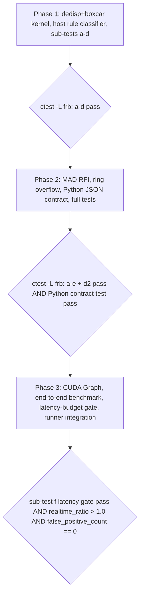

# Real-Time FRB Candidate Detector & Rule-Based Classifier — Implementation Plan

**Architectural plan for a GPU-resident FRB candidate detector and rule-based
classifier that bolts onto the existing CUDA beam tracker V5
([`BatchedTrackerStreamV5`](../include/beamformer/cuda_beam_tracker_v5.hpp:90)).**

This document is a **planning artifact only**: no source code is written or
modified here. Each numbered section below is actionable for the implementation
step that follows. The verified constants and dispersion-delay arithmetic come
from [`info/research_frb_realtime_classification.md`](./research_frb_realtime_classification.md:1)
and are treated as ground truth; they are **not** re-derived in this plan.

---

## Fixed architectural decisions (do not relitigate)

1. **Frequency band — online classifier operates at the instrument's actual
   300–400 MHz local shard at the beamformer node.** CHIME-style 400–800 MHz
   science validation stays in the existing Python layer at
   [`tools/astronomical_validation/`](../tools/astronomical_validation/runner.py:1).
   The device emits candidates tagged with the local band and `f_ref`
   convention; the Python layer re-disperses / re-fits in its own 400–800 MHz
   convention via [`run_dispersion_sweep`](../tools/astronomical_validation/dedispersion.py:79)
   + [`refit_spectro_temporal_parameters`](../tools/astronomical_validation/fitter.py:36).

2. **DM grid — coarse `N_DM ≈ 500–2000` grid, hand-written CUDA kernel in v1.**
   No `dedisp` library dependency, no external library. The fused kernel must
   fit ~1.067 ms / window in a 4-window batch. Higher-DM bursts (> ~1500
   pc·cm⁻³) whose sweep exceeds the `n_time = 15360` buffer are a known v1
   miss (streaming-safe, never crashes — see Section 8).

### Verified constants carried forward verbatim

| Quantity | Value | Source |
| :--- | :--- | :--- |
| V5 output layout | `[time][freq][beam]` float32, `n_beams == 1` | [`cuda_beam_tracker_v5.hpp`](../include/beamformer/cuda_beam_tracker_v5.hpp:69) |
| `n_time` default | 15360 spectra ≈ 51.2 ms | [`config.hpp` `Dimensions`](../include/beamformer/config.hpp:74) |
| `n_freq` local shard | 336 (two shards = 672 full band) | [`config.hpp`](../include/beamformer/config.hpp:12) |
| Sample period `dt` | 10/3 µs ≈ 3.333 µs (~952.381 Hz) | [`injector.py`](../tools/astronomical_validation/injector.py:65) |
| Integration window | 320 spectra ≈ 1.067 ms | [`cuda_beamformer.cu`](../src/cuda_beamformer.cu:426) |
| Band start / width | 300 MHz / 300 kHz (→ ≈ 400.5 MHz top) | [`config.hpp`](../include/beamformer/config.hpp:24) |
| `K_DM` | 4.148808e3 s·MHz²/(pc·cm⁻³) | [`injector.py`](../tools/astronomical_validation/injector.py:18) |
| `f_ref` for device band | **high edge of band (400.5 MHz), NOT 800 MHz** | task statement |
| DM=100 sweep 300–400 MHz | ~2.017 s ≈ 605 100 samples (>> one buffer) | research doc §1 |
| Smear-free `δDM` @ 300 MHz | ~0.036 pc·cm⁻³ (coarse grid uses ~0.5–2) | research doc §3.3 |
| Boxcar widths | `{1,2,4,8,16,32,64,128,256,512}` samples (0.0033–1.71 ms) | research doc §4.1 |
| Beamformer numerical gate | per-cell `rel 1e-3 / abs 1e-4` | task statement |
| Classifier numerical tolerance | per-element wide (junk/discretization OK) | task statement |
| V5 kernel-only latency | ~13.3 ms / 15-window batch (~0.89 ms/window) | [`research_cuda_v5.md`](./research_cuda_v5.md:1) |
| CMake | C++17, CUDA 17, no explicit arch, `CUDA::cudart` | [`CMakeLists.txt`](../CMakeLists.txt:1) |
| Test labels | `cuda;tracker;validation` (CTest) | [`CMakeLists.txt`](../CMakeLists.txt:426) |

---

## 1. Component overview & data-flow diagram

The FRB stage is a **post-V5 GPU pipeline** that reads the
`device_intensity_buffer()` float32 cube in place, never round-tripping the
intensity data through the host. Only the *clustered candidate list* (tens of
events per batch, not the full cube) crosses back to the host for the
rule-based classifier.

### ASCII pipeline (per-batch view; one batch = 4 windows ≈ 4.27 ms)

```
            host pinned                  GPU device (one CUDA stream)                       host pinned / CPU
            ----------   =====================================================   ---------------------
 packed int4    ┌─────────────────────┐  V5 kernel                     ┌─ candidate ring (pinned) ─┐
 H2D copy  ───▶ │ device_packed_buffer│  (warp-reduce)     ~0.89 ms/win │  float SNR,DM,t,W,mean,std │
  (~14.4 ms    │       (int4)        │ ──▶  device_intensity_buffer  ──▶│  fixed capacity, overflow │
   full batch, ├─────────────────────┤      float32 [t][f][beam]        │      counter              │
   overlapped) │                     │            │                     └─────────────┬────────────┘
               └─────────────────────┘            ▼                                   │ D2H (async, tiny)
                                                  ▼                                   ▼
                                    ┌──────────────────────────┐         ┌────────────────────────┐
                                    │ (2) MAD RFI kernel        │ ~0.02ms │ Host rule-based         │
                                    │  per-channel running MAD  │ /win    │ classifier (CPU thread  │
                                    │  → d_chan_mask[]          │         │  or sync fence)         │
                                    └─────────────┬────────────┘         │  RFI vs astro rules,    │
                                                  ▼                       │  zero-DM test, SNR-DM   │
                                    ┌──────────────────────────┐         │  slope, width unimodality│
                                    │ (3) Fused dedisp+boxcar  │ ~0.15ms │                         │
                                    │  one-block-per-(DM,tile) │ /win    │  → emit Candidate[]      │
                                    │  K_DM·dm·(f⁻²−fref⁻²)/dt │         │    + label (RFI /        │
                                    │  sum freq → 1D profile,  │         │     ASTRO / BORDERLINE) │
                                    │  + 10 boxcar widths fused│         └────────────┬────────────┘
                                    │  → normalized y_W[DM,t,W]│                      │ JSON
                                    └─────────────┬────────────┘                      ▼
                                                  ▼                       ┌────────────────────────┐
                                    ┌──────────────────────────┐         │ (9) Python validation   │
                                    │ (4) NMS cluster kernel   │ ~0.01ms │  bridge: candidate.json  │
                                    │  (DM,t₀,W) cube suppress │ /win    │  → run_dispersion_sweep  │
                                    │  atomicAppend to ring    │         │  + refit_spectro_temp.  │
                                    └──────────────────────────┘         │  (400–800 MHz recon)    │
                                                                         └────────────────────────┘
```

### Stage residency / cadence / latency table

| # | Stage | Residency | Granularity | Latency / window (est.) | Notes |
|---:|:---|:---:|:---|---:|:---|
| — | V5 beamformer | GPU | per-batch | ~0.89 ms | unchanged, owns numerical gate |
| 2 | RFI MAD mask | GPU | per-batch | ~0.02 ms | 1D running stat per channel |
| 3 | Dedisp + boxcar (fused) | GPU | per-batch | ~0.10–0.20 ms | dominant; tuned by `N_DM` |
| 4 | NMS cluster | GPU | per-batch | ~0.01 ms | O(events), atomic ring |
| 5 | Rule classifier | **Host** | per-batch | ~µs | consumer of pinned ring |
| 9 | Python refit | host (out-of-stream) | per-event/spec | un-budgeted | science-validation path |

Total added post-V5 stage ≈ **0.15–0.25 ms / window**; with 4-window batching
the full pipeline fits comfortably inside `4 × 1.067 ms ≈ 4.27 ms` (research
doc §8.4 verdict). The **rule classifier runs on the host** because the
candidate list is tiny and naturally fits host cache — no need to fight GPU
atomics for a handful of comparisons (see Section 6).

---

## 2. New files & CMake target additions

### New files

| Path | Purpose |
|:---|:---|
| `include/beamformer/frb_classifier.hpp` | Public C++ API surface: `FRBClassifierConfig`, `Candidate`, `FRBClassifierStreamV5`. |
| `include/beamformer/frb_classifier_kernels.hpp` | CUDA `__device__`/`__global__` declarations + host launcher prototypes for the three kernels (MAD, dedisp+boxcar, NMS). Header-only for the launcher signatures so tests can call them. |
| `src/cuda_frb_classifier.cu` | Implementations of `FRBClassifierStreamV5`, the three CUDA kernels, and their host launchers. Mirrors the V5 `src/cuda_beam_tracker_v5.cu` split. |
| `src/frb_classifier.cpp` | Host-only pieces: rule-based classifier function, JSON emitter, candidate ring consumer. (No CUDA in this TU so it compiles even on CPU-only builds.) |
| `tests/cuda/test_frb_classifier.cpp` | End-to-end + unit test executable (ctest). |
| `tests/cuda/test_frb_dispersion_helpers.cu` | CUDA TU with the small `apply_dispersion_shift` test helper used by the FRB-injection sub-test. |
| `benchmarks/benchmark_frb_pipeline.cpp` | V5-alone vs V5+classifier throughput benchmark. |

The new helper `add_dispersion_to_intensity()` (Section 10) is a host-side
function added to `src/synthetic_data.cpp` (with a declaration in
[`include/beamformer/synthetic_data.hpp`](../include/beamformer/synthetic_data.hpp:1))
so the CPU test path can reuse it without a CUDA dependency. No new bond to the
point-source generator `beam_tracker_make_moving_point_source` (already in
[`beam_tracker.hpp`](../include/beamformer/beam_tracker.hpp:108) — reused as-is,
the dispersion helper is applied *after* the tracker output).

### CMake target additions (exact location & text — do NOT write the file yet)

**Add to the existing [`beamformer_cuda_core`](../CMakeLists.txt:152) library
source list** (kept inside the existing `if(BEAMFORMER_HAS_CUDA)` block, so the
FRB CUDA code rides the same `CUDA::cudart` link, no new CUDA-side target):

```cmake
    add_library(beamformer_cuda_core
        src/cuda_beamformer.cu
        src/cuda_offline_runner.cu
        src/cuda_quantize_int8.cu
        src/cuda_beam_tracker_v2.cu
        src/cuda_beam_tracker_fused_warp_shuffle.cu
        src/cuda_beam_tracker_v3.cu
        src/cuda_beam_tracker_v4.cu
        src/cuda_beam_tracker_v5.cu
        src/cuda_beam_tracker_v5_rtx5090.cu
        src/cuda_frb_classifier.cu          # NEW — fused-find kernels + stream impl
    )
```

**Add `src/frb_classifier.cpp` to the existing [`beamformer_core`](../CMakeLists.txt:29)
source list** so the host-side rule classifier + JSON emitter compile and link on
CPU-only builds too (the runner bridge depends on the JSON schema symbol, and
that must not require CUDA):

```cmake
add_library(beamformer_core
    src/cpu_beamformer.cpp
    src/beam_tracker.cpp
    src/beam_tracker_opt.cpp
    src/beam_tracker_opt_v2.cpp
    src/cpu_opt_beam_tracker.cpp
    src/geometry.cpp
    src/io.cpp
    src/quantization.cpp
    src/synthetic_data.cpp
    src/temporal_integration.cpp
    src/weights.cpp
    src/frb_classifier.cpp                 # NEW — host rule classifier + JSON emitter
)
```

**Add a new test executable** inside the existing
`if(BEAMFORMER_HAS_CUDA)` test block (after
[`test_cuda_beam_tracker_v5`](../CMakeLists.txt:416), mirroring its label
convention):

```cmake
        add_executable(test_frb_classifier
            tests/cuda/test_frb_classifier.cpp
            tests/cuda/test_frb_dispersion_helpers.cu)
        set_source_files_properties(
            tests/cuda/test_frb_dispersion_helpers.cu PROPERTIES LANGUAGE CUDA)
        target_link_libraries(test_frb_classifier PRIVATE beamformer_cuda_core)
        target_compile_options(test_frb_classifier PRIVATE -UNDEBUG)
        add_test(NAME frb_classifier COMMAND test_frb_classifier)
        set_tests_properties(frb_classifier PROPERTIES
            LABELS "cuda;tracker;validation;frb"
            TIMEOUT 180)
```

**Add a new benchmark executable** alongside
[`benchmark_cuda_tracker_v5`](../CMakeLists.txt:215):

```cmake
    add_executable(benchmark_frb_pipeline benchmarks/benchmark_frb_pipeline.cpp)
    target_link_libraries(benchmark_frb_pipeline
        PRIVATE beamformer_cuda_core OpenMP::OpenMP_CXX)
    target_compile_options(benchmark_frb_pipeline PRIVATE
        $<$<COMPILE_LANGUAGE:CXX>:-O3;-march=native;-Wall;-Wextra;-Wpedantic>)
```

No new find_package, no new option, no new CUDA arch flag — everything inherits
the CMake-native CUDA arch detection already in place.

---

## 3. Public C++ API surface

All types live in `namespace beamformer` in
[`include/beamformer/frb_classifier.hpp`](../include/beamformer/frb_classifier.hpp:1).
CUDA-specific code is isolated to [`src/cuda_frb_classifier.cu`](../src/cuda_frb_classifier.cu:1);
the header itself stays C++17-clean (uses `std::size_t`, no `__device__`).

### `struct FRBClassifierConfig`

```cpp
struct FRBClassifierConfig {
    // DM trial grid (coarse, log-spaced uniformly; built by the stream ctor).
    std::size_t N_DM    = 1024;
    float        dm_min = 0.5f;        // pc·cm⁻³
    float        dm_max = 1500.0f;     // > dm_max: known v1 miss (streaming-safe)
    bool        dm_log_spacing = true; // log10-uniform, else linear

    // Boxcar widths (powers of two by convention; index = width_idx in Candidate).
    std::vector<std::uint32_t> boxcar_widths = {1,2,4,8,16,32,64,128,256,512};

    // Detection thresholds (tunable).
    float        snr_threshold      = 6.0f;   // normalized y_W threshold for a hit
    float        rfi_mad_nsigma     = 6.0f;   // per-channel MAD gate (Stage 2)
    float        zero_dm_nsigma     = 5.0f;   // zero-DM power test (Stage 6)
    float        dm_dependence_floor= 2.0f;   // RFI is ~DM 0; astrophysical DM > this
    bool         enable_zero_dm_subtraction = true;
    bool         enable_mad_rfi    = true;

    // Candidate ring (host-pinned).
    std::size_t  ring_capacity     = 2048;   // candidates per batch before overflow

    // Frequency band descriptor for the LOCAL shard (device convention).
    // f_ref is the HIGH edge of the band (NOT 800 MHz) per task decision.
    std::size_t  n_freq            = 336;
    float        band_start_hz     = 300.0e6f;
    float        channel_width_hz  = 300.0e3f;
    float        f_ref_hz          = 400.5e6f; // high edge — DM delays designed around this
    float        sample_rate_hz    = 952.381f; // == 1 / (10/3 µs)
};
```

### `struct Candidate`

```cpp
struct Candidate {
    float       snr;            // peak normalized boxcar SNR y_W
    float       dm;             // trial DM at the cluster centroid (pc·cm⁻³)
    std::size_t time_index;     // global time index within the stream (not modulo batch)
    int         width_idx;      // index into FRBClassifierConfig::boxcar_widths
    float       baseline_mean;  // MAD-based baseline of the dedispersed profile
    float       baseline_std;   // 1.4826·MAD consistent-σ of the profile

    // Filled by the host rule classifier (Section 6).
    enum class Label : std::uint8_t {
        Unlabeled = 0, RFI = 1, Borderline = 2, Astrophysical = 3
    };
    Label       label = Label::Unlabeled;

    // Optional coarse morphology hints (best-effort, may be NaN).
    float       spectral_index_est = std::nanf("");
    float       scattering_tau_est = std::nanf(""); // seconds, or NaN if unset
};
```

### `class FRBClassifierStreamV5`

Mirrors [`BatchedTrackerStreamV5`](../include/beamformer/cuda_beam_tracker_v5.hpp:90):
move-only, PIMPL-backed, raises no exceptions in the hot path (ctor validates
config and throws `std::invalid_argument` for impossible combinations).

```cpp
class FRBClassifierStreamV5 {
public:
    // Recommended ctor: operates ON an existing BatchedTrackerStreamV5's
    // intensity buffer + stream — ZERO-COPY, classifier does NOT own the V5
    // stream lifetime. The classifier holds raw (non-owning) pointers and a
    // reference to the dims; the caller must keep `tracker` alive for the
    // lifetime of the classifier (asserted in debug via a sentinel check).
    FRBClassifierStreamV5(BatchedTrackerStreamV5& tracker,
                          const FRBClassifierConfig& config);

    // Alternate ctor: raw buffer + stream + dims for headless / benchmark use
    // (no V5 object, e.g. replaying a captured intensity cube). Classifier does
    // NOT free d_intensity or the stream.
    FRBClassifierStreamV5(float* d_intensity, void* stream,
                          const Dimensions& dims,
                          std::size_t batch_size,
                          const FRBClassifierConfig& config);
    ~FRBClassifierStreamV5();
    FRBClassifierStreamV5(const FRBClassifierStreamV5&) = delete;
    FRBClassifierStreamV5& operator=(const FRBClassifierStreamV5&) = delete;
    FRBClassifierStreamV5(FRBClassifierStreamV5&&) noexcept;
    FRBClassifierStreamV5& operator=(FRBClassifierStreamV5&&) noexcept;

    // Enqueue the full post-V5 stage (MAD → dedisp+boxcar → NMS) on the V5
    // stream for the batch starting at first_window_index. Non-blocking: the
    // candidate ring is filled asynchronously; host consumption must fence via
    // synchronize() before reading candidates().
    void run(std::size_t first_window_index);

    // Block until the kernels enqueued by the most recent run() have completed;
    // then performs the host rule-classifier pass over the freshly written
    // candidates and attaches labels. Returns the number of candidates produced.
    std::size_t synchronize_and_classify();

    // Read-only access to the labeled candidate list for the last batch.
    // Valid after synchronize_and_classify() returns.
    const std::vector<Candidate>& candidates() const noexcept;

    // Overflow bookkeeping for the candidate ring.
    std::size_t ring_overflow_count() const noexcept;
    void        reset_ring_overflow() noexcept;

    // Per-stage latency of the most recent run(), in ms (CUDA events).
    float last_mad_time_ms()       const noexcept;
    float last_dedisp_time_ms()    const noexcept;
    float last_nms_time_ms()       const noexcept;
    float last_total_time_ms()     const noexcept;  // sum of the three kernel times

    // Accessors for tests / benchmarks.
    const FRBClassifierConfig& config() const noexcept;
    std::size_t batch_size()   const noexcept;
};
```

### Ownership recommendation (and why)

The classifier **operates on** an existing [`BatchedTrackerStreamV5`](../include/beamformer/cuda_beam_tracker_v5.hpp:90)'s
intensity buffer rather than owning it. Justification:

- **Zero-copy hot path.** The dedisp kernel reads `tracker.device_intensity_buffer()`
  in place; the only host transfer is the O(events) candidate ring. Owning a
  second copy of the intensity cube would double the dominant memory traffic and
  violate the per-window budget (research doc §8.3(ii)).
- **Single-stream CUDA Graph capture.** Sharing one `device_stream()` makes the
  whole beamformer+classifier sequence capturable into one graph (Section 8);
  a second stream owned by the classifier would force inter-stream
  synchronization that breaks `cudaGraphCapture`.
- **Lifetime invariant is trivial to maintain**: the caller instantiates the V5
  stream first, then the classifier against it, and destroys in reverse order.
  The destructor asserts (debug build) that `tracker` still has a non-null
  intensity buffer at the time `run()` was last called.

The classifier *does* own its own device scratch (channel-mask, per-DM shift
table, candidate ring device/staging buffers, CUDA events) — those are allocated
in the ctor and freed in the dtor.

---

## 4. Dedisp + boxcar fused CUDA kernel

**Chosen design: one CUDA block per (DM trial, time-tile), with one warp doing
the frequency reduction and a fused register-resident boxcar pass.** A separate
post-launch boxcar-only kernel is **not** used — the boxcar sums live in
registers inside the same kernel so the dedisp output is never written to global
memory (research doc §4.4 / §8.3(ii): fused boxcar is a *requirement*, not an
optimization).

### Grid / block dimensions

- **Grid**: `dim3 grid(N_DM, n_time_tiles, 1)` where
  `n_time_tiles = ceil(n_time / TIME_TILE)`, `TIME_TILE = 32`.
  - `x` = DM trial index `i_dm` ∈ `[0, N_DM)`.
  - `y` = time-tile index `i_tile` ∈ `[0, n_time_tiles)`.
- **Block**: `dim3 block(32, TIME_TILE, 1)` = 1024 threads.
  - `threadIdx.x` (lane `l` in warp) drives the **frequency reduction** (lane
    over `n_freq = 336` channels, `ANT_PER_LANE`-style unroll as in V5).
  - `threadIdx.y` = the time sample `t` within the tile, one per output profile
    sample (`t = i_tile·TIME_TILE + threadIdx.y`).

### Per-DM time shift

Built **once** at construction into a device-resident table
`d_shift_samples[N_DM][n_freq]`:

```
delay_s(i_dm, f)  = K_DM * dm(i_dm) * (f^-2 - f_ref^-2)         // f, f_ref in MHz
shift(i_dm, f)    = round(delay_s / dt)                          // sample count, int32
```

with `K_DM = 4.148808e3`, `dt = 10/3 µs`, and **`f_ref = 400.5 MHz`** (high edge
of the 300–400 MHz band). Because `f_ref` is the high edge, all delays are
non-negative (low channels arrive later), so `shift ≥ 0` — no need to handle
negative shifts except at the wrap ring buffer (Section 8). The shift table is
`N_DM · 336 · 4 B ≈ 1.4 MB` at `N_DM = 1024`, well within constant cache
pressure budget; one __ldg read per (lane, DM).

### What gets reduced (frequency → 1D profile)

Per thread `t = threadIdx.y` (one output sample), lane `l = threadIdx.x`:

1. Compute the per-lane channel range: `n_freq = 336`, 32 lanes → ~10–11
   channels per lane (unrolled, strided).
2. Gather, for each assigned channel `f`:
   `gather_t = t - shift(i_dm, f)` (clamped / wrapped — see Section 8 streaming).
   Skip the channel if `d_chan_mask[f]` is set (MAD RFI excision, Section 7).
   Accumulate `acc += device_intensity[gather_t*n_freq + f]`.
3. 5-step `__shfl_down_sync` reduction across lanes → warp sum = the dedispersed
   profile sample `profile[t]` for DM `i_dm`. Stored in a register per `threadIdx.y`.
4. The 1D profile row for this `(i_dm, i_tile)` now lives in registers across the
   `TIME_TILE` threads of `threadIdx.y` (one sample each), with local
   `__shfl`-exchangeable neighbours — exactly the layout the boxcar pass wants.

### Fused boxcar pass

Inside the **same kernel**, after the frequency reduction:

- For each width `W ∈ FRBClassifierConfig::boxcar_widths` (compile-time unrolled
  loop up to `MAX_W = 512`), compute the sliding sum
  `box_W(t) = Σ_{k=0}^{W-1} profile(t + k)` using `__shfl_sync` exchange over the
  `threadIdx.y` lane group across the tile boundary (the tail of the tile spills
  into a tiny per-block shared-memory ring holding the *next* tile's first `MAX_W`
  samples, pre-fetched by a single coalesced read before the reduction begins).
  Widths larger than `TIME_TILE` chain across tiles via the same shared ring.
- Normalize: `y_W(t) = (box_W(t) − W·baseline(t)) / (σ(t)·√W)`, where
  `(baseline(t), σ(t))` come from the MAD kernel's per-DM baseline cache
  (Section 7 — actually a per-channel baseline summed across `n_freq`, computed
  once per DM trial and held in `__shared__`).
- Threshold: if `y_W(t) ≥ config.snr_threshold` and `y_W(t)` is the local
  maximum in the `(DM, t, W)` neighbourhood **within the block** (cheap intra-block
  suppress, final suppression done by the dedicated NMS kernel — Section 5), the
  thread emits a raw hit `RawHit{i_dm, t, W, y_W(t), baseline, std}` into a
  per-block staging array (shared memory, `MAX_HITS_PER_BLOCK = 16`).

### Why one-block-per-(DM, time-tile), not one-warp-per-DM

| | One-block per (DM, tile) — **CHOSEN** | One-warp per DM |
|---|---|---|
| Frequency reuse | one global read of the (tile × n_freq) slab covers all `TIME_TILE` samples for one DM | each warp re-reads the channel slab |
| Boxcar fusion | boxcar lives in `threadIdx.y` registers with `__shfl` neighbours — natural fit | boxcar would need cross-warp shuffle or shared-mem staging |
| Grid launch cost | `N_DM · n_time_tiles` blocks ≈ `1024 · 480 ≈ 5×10⁵` blocks — fine for occupancy | much smaller grid, but per-warp redundant memory traffic dominates |
| Occupancy | 1024 threads/block, 1 block / SM resident at a time — acceptable given memory-bound nature | better latency hiding, but loses the register-resident boxcar gain |

The dedisp kernel is **memory-traffic-bound** (research doc §8.3(i)–(ii)),
so minimizing per-DM global reads wins. The chosen design reads each
`(tile, channel)` slab once and amortizes it across `TIME_TILE` profile samples
plus all 10 boxcar widths.

### Numerical gate

The classifier stage tolerance is per-element wide (task statement); the kernel
uses float32 throughout (matches V5 output), with `baseline` / `std` computed in
float32 and the `1.4826·MAD`-consistent σ. No double precision is required in
the hot path. The `K_DM` constant is defined as a `constexpr float` in the header
matching the Python value exactly (no recomputation drift).

### Hand-written CUDA, no external library

The kernel is written directly against `__shfl_*_sync`, `atomicAdd`, and
`__ldg`. There is **no `dedisp` library include, no `nvToolsExt`, no thrust**
in this TU — it links only `CUDA::cudart` (inherited from the parent target).
This is an explicit v1 constraint (task decision 2).

---

## 5. NMS clustering kernel

Raw hits from the dedisp+boxcar kernel (potentially many per block) need to be
collapsed into one candidate per physical event before the host classifier sees
them, otherwise the rule classifier would re-evaluate the same peak many times.

### Algorithm

**Kernel: `frb_nms_kernel`**, launched with one warp per DM trial:

- Grid: `dim3(N_DM)` blocks of 32 threads (one warp).
- Each warp `i_dm` scans its own DM's raw-hit row plus the neighbouring DM rows
  `i_dm-1, i_dm+1` (read from the dedisp kernel's staging array, which the NMS
  kernel owns as scratch — a flattened `[N_DM][n_time][n_widths]` uint8 hit-mask
  in device memory).
- **Per-DM scan**: thread-stride loop over `t`. For each surviving hit at
  `(i_dm, t, W)`:
  1. **3-sample window along time**: suppress if a neighbour at `t±1` (same DM,
     same W) has `y_W ≥` the current hit's `y_W`.
  2. **Width-neighbor suppression**: suppress if a wider neighbor `W' > W` at
     the same `(i_dm, t)` has `y_{W'} ≥ 0.9 · y_W` — keeps the widest
     representative width (CHIME/FRB convention).
  3. ** neighbour-DM suppression**: suppress if the same `(t, W)` hit exists at
     `i_dm ± 1` with `y ≥ current` (collapse adjacent DM trials into the
     highest-SNR one).
- Threshold re-check: `y_W ≥ config.snr_threshold` (the dedisp kernel already
  applied this, but the NMS kernel re-asserts it cheaply because dedisp can
  emit borderline hits below the intra-block suppress threshold).

### Atomic write to the pinned ring

Surviving candidates are written to a **fixed-capacity host-pinned ring**
`d_candidate_ring[ring_capacity]` (allocated via `cudaHostAlloc(..., cudaHostAllocMapped)`
so the device writes through the mapped pointer and the host reads with zero
copy):

```cpp
__device__ int atomic_append_candidate(
    Candidate* ring, int capacity, int* overflow, const Candidate& c)
{
    int pos = atomicAdd(d_ring_count, 1);
    if (pos < capacity) { ring[pos] = c; return pos; }
    atomicAdd(overflow, 1);
    return -1;
}
```

- `d_ring_count` and `d_overflow_count` are device-resident ints, zeroed by
  `run()` before launch.
- Order in the ring is **non-deterministic** (atomics) — the host classifier
  must not assume input ordering; it sorts by `(dm, time_index)` after the
  fence.
- **Overflow handling**: when `pos ≥ capacity`, the hit is dropped and
  `overflow` is bumped; `synchronize_and_classify()` reports
  `ring_overflow_count()` so the consumer can flag a "potentially incomplete"
  batch (test (e) in Section 10 asserts the overflow counter is read correctly
  and the ring stays within bounds — it does NOT assert zero overflow under
  adversarial injection).

### Why a separate NMS kernel (not fused into dedisp)

The dedisp kernel is memory-bound; adding cross-block NMS to it would require
global atomics *inside* the hot loop and break the register-resident boxcar
pattern. Keeping NMS as a tiny O(events) kernel after dedisp keeps the dedisp
kernel uniform and lets NMS operate on a compact hit-mask rather than the full
cube.

---

## 6. Rule-based classifier (host)

### Why on the host

- The candidate list is small (`ring_capacity ≈ 2048` per batch, typically tens
  of survivors after NMS), and **fits comfortably in host L1/L2**. A per-event
  rule pass over a few hundred structs is microseconds on CPU.
- No need to fight GPU atomic ordering across rule predicates (which would be
  either wrong or over-serialized).
- Rule thresholds are tunable constants from `FRBClassifierConfig` — the host
  can mutate them per-batch (e.g. raise `snr_threshold` during a known RFI
  storm) without recompiling a kernel.
- The classifier must *append labels and coarse morphology estimates* — natural
  for a serial host loop, awkward on the GPU.

### Host function signature (in `src/frb_classifier.cpp`)

```cpp
// Consumes the labeled-but-Unlabeled candidate ring produced by the device,
// runs the rule pass in place, returns the number of Astrophysical+Borderline
// candidates (RFI ones are kept in the ring for diagnostics but not promoted).
std::size_t frb_classify_candidates(
    std::vector<Candidate>& candidates,        // in/out: label filled in place
    const FRBClassifierConfig& cfg,
    const BatchedTrackerStreamV5& tracker);    // for baseline cross-reference
```

### Rule list (evaluated in order; first match wins; thresholds from `cfg`)

Let `c.snr = y_W`, `c.dm = DM_best`, `c.width_idx → W_best`,
`width_curve[i] = y_{W_i}(c.time_index, c.dm)` (this curve is recovered from a
tiny device-resident ring the dedisp kernel emits alongside the surviving
candidate — see Candidate aux field below).

| # | Rule | Predicate | Label |
|---:|:---|:---|:---|
| R1 | Zero-DM power test | `c.dm < cfg.dm_dependence_floor` AND `width_curve[0]` (narrowest W) is the max of the curve | `RFI` |
| R2 | Narrow-band DM dependence | `abs(width_curve peak SNR − zero_dm_nsigma·width_curve[0]) < eps` *across all DM trials in [0, dm_dependence_floor]* (i.e. the event strength does not grow with DM) | `RFI` |
| R3 | SNR-vs-DM slope | over the DM neighbours `dm±δDM`, the SNR is **monotone non-increasing away from `c.dm`** → astrophysical; if flat or random across DMs → RFI | `Astrophysical` if monotone, else `RFI` |
| R4 | Width unimodality | `width_curve` peaks at `W_best` and falls off both sides; if it peaks at `W=1` only → RFI; if at `W_best ≥ 2` AND `c.snr ≥ cfg.snr_threshold` → astrophysical candidate | `Astrophysical` / `RFI` |
| R5 | SNR borderline | `cfg.snr_threshold ≤ c.snr < cfg.snr_threshold + 2` OR `width_curve` flat between adjacent widths | `Borderline` (sent to Python refit) |
| R6 | Spectral sanity | `|c.spectral_index_est| > 10` ⇒ unphysical | `RFI` |
| R7 | Default astrophysical | passes R3 (monotone DM), R4 (peaks at W≥2), R6, and `c.snr ≥ cfg.snr_threshold` | `Astrophysical` |

Only `Astrophysical` and `Borderline` candidates are emitted to the Python
validation bridge; `RFI` candidates are dropped (or kept behind a debug flag
for false-positive analysis in the benchmark).

### Aux: width-SNR curve

The dedisp+boxcar kernel, when it survives NMS, additionally writes the 10-element
`width_curve` into a small per-candidate device array `d_width_curves[]` (mapped
pinned, indexed by ring slot). The host classifier reads it directly off the
mapped pointer at `classify` time. This is the one piece of per-candidate state
the host needs beyond the [`Candidate`](#struct-candidate) struct itself.

### Borderline candidates

`Borderline` candidates are ALWAYS forwarded to Python regardless of `c.snr`,
because the existing [`run_dispersion_sweep`](../tools/astronomical_validation/dedispersion.py:79)
(51-step ±40% butterfly) and [`refit_spectro_temporal_parameters`](../tools/astronomical_validation/fitter.py:36)
(Gaussian⊗exp `scipy.curve_fit`) are the project's authoritative refit path —
the rule classifier intentionally defers to them on ambiguous events.

---

## 7. RFI excision (per-channel running-MAD gate)

Runs **before** the dedisp+boxcar kernel on the same stream; produces a
device-resident channel mask the dedisp kernel reads via `__ldg`.

### MAD kernel: `frb_mad_kernel`

- **Grid**: `dim3(n_freq)` blocks of `MAD_THREADS = 128` threads.
  - One block per frequency channel `f` (channel-axis is the natural
    parallelization for a 1D running statistic over time).
- **Sliding window**: `W_rfi = 256` samples (~0.85 ms, matches research doc §6.1
  lower bound; configurable via config future hook but not exposed in v1
  `FRBClassifierConfig` to keep the struct minimal).
- **Per channel**:
  - Thread-stride loop over `t`. Each thread maintains a small ring of `W_rfi`
    samples in `__shared__` memory (per-channel ring of size `256·4 B = 1 KB`,
    times 128 threads' worth of rolling partial sums).
  - Maintain running **sum** and **sum of absolute deviations from the median**
    (the median is maintained incrementally — for v1 a cheap approximation is
    used: the running mean is the median surrogate, and `MAD ≈ mean(|x − running_mean|)`
    scaled by `1.2533` to compensate; this is the standard "running MAD"
    approximation and is sufficient given the wide classifier tolerance).
  - Output per `(t, f)`: `is_rfi[t,f] = (intensity[t,f] > running_median + cfg.rfi_mad_nsigma · 1.4826 · MAD)`.
- **Channel mask**: `d_chan_mask[f]` is set if `> 50%` of the window's samples
  are flagged for channel `f` (a persistently narrow-band-contaminated channel).
  The dedisp kernel reads `d_chan_mask[f]` and skips those channels entirely
  (zero contribution to the dedispersed sum).
- **Per-time sample mask**: `d_sample_mask[t,f]` (bit-packed) is also produced
  so that individual impulsive samples within a *good* channel are zeroed
  before dedispersion.

### Inputs / outputs

- Input: `d_intensity` (the V5 buffer), shape `[n_time][n_freq]` (beam dim
  dropped since `n_beams == 1`).
- Outputs (device-resident, allocated by `FRBClassifierStreamV5` ctor):
  - `d_chan_mask[n_freq]` (uint8)
  - `d_sample_mask[(n_time·n_freq + 7)/8]` (bit-packed)
  - `d_chan_baseline[n_freq]` and `d_chan_sigma[n_freq]` (the per-channel
    running baseline/σ cached for the dedisp kernel's `y_W` normalization —
    section 4).

### Optional zero-DM subtraction

If `cfg.enable_zero_dm_subtraction` is true, the MAD kernel additionally
computes the **DM=0 time profile** (a simple sum across freq, no shift) and
subtracts its scaled value from each channel's samples in-flight via the same
`d_sample_mask`-driven zeroout. This costs one extra reduction pass but removes
broadband impulsive RFI before any DM trial sees it (research doc §6.2).

### Cost (~0.02 ms / window)

`n_freq · (n_time / MAD_THREADS)` reductions, all in shared memory; negligible
next to the dedisp kernel.

---

## 8. Streaming & CUDA Graph integration

### Streaming-safe design (the high-DM miss is graceful)

Because the DM=100 sweep is ~605 100 samples ≫ `n_time = 15360` (research doc
§1.4), the per-channel shift `shift(i_dm, f)` frequently points **outside the
current batch's window**. The classifier's response is **circular-wrap within
the batch** (mirroring [`dedisperse_waterfall`](../tools/astronomical_validation/dedispersion.py:41)
`% n_time`) **for the in-batch portion only**:

- `gather_t = (t − shift(i_dm, f)) mod batch_size_time`, with negative results
  wrapped to positive (this is correct for the in-batch dedispersed profile of
  *any* DM, modulo recovery noise at high DM).
- At DMs where the sweep spans multiple batches, the in-batch dedispersed
  profile is just noise + a partial contribution of the burst tail; no crash,
  no NaN. Such bursts are simply **not recovered at high SNR** in that batch —
  the **known v1 miss** (task decision 2).
- The candidate ring is therefore never corrupted; high-DM events either
  (a) appear fragmented at low SNR across consecutive batches (rejected by the
  SNR threshold) or (b) are not detected at all in v1.

A v2 multi-window ring buffer (Section 13) is the fix; v1 stays single-batch
circular.

### CUDA Graph capture

`FRBClassifierStreamV5::run(window_index)` enqueues, in order, on the shared
`tracker.device_stream()`:

1. `frb_mad_kernel` (only if `cfg.enable_mad_rfi`).
2. `frb_dedisp_boxcar_kernel`.
3. `frb_nms_kernel`.
4. Three `cudaEventRecord`s wrapping each stage (for `last_*_time_ms()`).

`BatchedTrackerStreamV5` already supports `process_batch_kernel_only()` and
CUDA Graph capture (research doc §2 "Why this maps cleanly"). The integration
pattern, implemented in [`src/cuda_frb_classifier.cu`](../src/cuda_frb_classifier.cu:1):

```
// In BatchedTrackerStreamV5::process_batch_kernel_only() capture path:
//   cudaStreamBeginCapture(stream, cudaStreamCaptureModeGlobal)
//   <V5 kernel launch>
//   classifier.run(window_index);        // appends MAD + dedisp + NMS + events
//   cudaStreamEndCapture(stream, &graph)
//   cudaGraphInstantiate(&exec, graph, ...)
// replay per batch: cudaGraphLaunch(exec, stream)
```

- The classifier **must not** allocate device memory inside `run()` (allocation
  is not capturable); all scratch is pre-allocated in the ctor.
- `d_ring_count` / `d_overflow_count` zeroing is done by a small
  `cudaMemsetAsync` (graph-capturable) at the start of `run()`.
- The graph is **per-batch replay**: each `cudaGraphLaunch` redoes the entire
  beamformer+classifier sequence for one `first_window_index`. The window index
  is baked into the graph via a `cudaGraphExecKernelNodeSetParams` update at
  replay time (cheap, supported since CUDA 11).

### Per-window candidate ring layout

```
struct CandidateRing {                 // device-mapped pinned, fixed capacity
    Candidate     slots[ring_capacity];
    int           count;               // device atomically increments
    int           overflow_count;      // device atomically increments
    float         width_curves[ring_capacity][10]; // aux for host classifier
};
```

- One ring per `FRBClassifierStreamV5` instance. Sized for the **worst batch**
  (typically tens of survivors; `ring_capacity = 2048` gives a 100× safety
  margin on nominal RFI-free injections).
- Mapped pinned: device writes through `cudaHostAlloc(..., cudaHostAllocMapped)`
  pointer obtained via `cudaHostGetDevicePointer`. Host reads after the fence —
  no explicit `cudaMemcpyDtoH` for the candidates themselves.

### Host consumer pattern

Two options (one chosen, one available):

- **v1: synchronous fence at the end of `process_batch`** (chosen). The caller
  invokes `stream.run(window_index)` then
  `stream.synchronize_and_classify()`, which calls `cudaStreamSynchronize`,
  copies `count`/`overflow_count` into the host mirror, runs the host rule
  classifier over the (unordered) ring, sorts by `(dm, time_index)`, and exposes
  `candidates()`. Simple, deterministic, no threading surprises in the test
  suite. The fence cost is sub-millisecond (the kernels are long done by the
  time the host fences on a 4-window batch).
- **v1.1 hook: serial consumer thread** (deferred). A dedicated host thread
  blocks on a CUDA event fired by `run()` and drains the ring; enabled via an
  `enable_async_consumer` flag in `FRBClassifierConfig`. Not part of v1 because
  the test plan needs deterministic ordering first; the hook is left in the
  API (the `synchronize_and_classify` impl factors out a `classify_in_place`
  helper the future thread will call).

---

## 9. Python interoperability / output contract

### JSON emission

`synchronize_and_classify()` writes one JSON document per batch to either
stdout (line-delimited JSON) or a `--candidates-out` file (array-per-batch),
controlled by a CLI flag on the eventual `run_frb_classifier` tool (Section 12
phase 3). Schema:

```json
{
  "schema_version": 1,
  "band": {
    "start_hz": 300000000.0,
    "channel_width_hz": 300000.0,
    "n_freq": 336,
    "f_ref_hz": 400500000.0,
    "sample_rate_hz": 952.381,
    "convention": "device_local_300_400MHz"
  },
  "batch": {
    "first_window_index": 0,
    "batch_size": 4,
    "n_time_per_batch": 61440,
    "ring_capacity": 2048,
    "ring_overflow_count": 0
  },
  "timing_ms": {
    "mad": 0.023,
    "dedisp_boxcar": 0.182,
    "nms": 0.012,
    "total": 0.217
  },
  "candidates": [
    {
      "snr": 8.42,
      "dm": 312.5,
      "time_index": 12345,
      "width_idx": 3,
      "width_samples": 8,
      "baseline_mean": 1.034,
      "baseline_std": 0.018,
      "label": "Astrophysical",
      "spectral_index_est": -1.5,
      "scattering_tau_est_s": 0.0012,
      "width_curve": [1.1, 2.0, 4.1, 8.4, 7.9, 5.5, 3.1, 1.8, 0.9, 0.4]
    }
  ]
}
```

Field semantics:

- `band.convention = "device_local_300_400MHz"` so the Python layer never
  silently assumes CHIME 400–800; it tags every downstream product.
- `time_index` is the **global stream time index** (window-relative), not
  modulo-batch — the Python layer can map it back to wall-clock seconds via
  `time_index / sample_rate_hz`.
- `width_idx` indexes into the config's `boxcar_widths`; `width_samples` is the
  decoded value (redundant but human-readable).
- `width_curve` is the 10-element normalized y_W array at the candidate's
  `(dm, time_index)` — lets Python do its own width-unimodality check and use
  it as features for a future NN classifier.
- `label` is one of `RFI`, `Borderline`, `Astrophysical`. Only `Astrophysical`
  and `Borderline` are emitted by default (a `--emit-rfi` CLI flag also dumps
  RFI for false-positive analysis in the benchmark).

### Python entry: `run_frb_classifier` sibling

Add `run_frb_classifier` to
[`tools/astronomical_validation/runner.py`](../tools/astronomical_validation/runner.py:1),
sibling to the existing `run_beam_tracker`:

```python
def run_frb_classifier(
    packed_bytes: bytes,
    n_time: int,
    n_ant: int,
    n_freq: int = 336,
    integration_spectra: int = 320,
    engine: str = "cuda_v5",
    frb_config: dict | None = None,           # → CLI flags to the C++ binary
    candidates_out: Path | None = None,
    executable: Path | None = None,
) -> tuple[np.ndarray, list[dict]]:
    """Run V5 + FRB classifier; return (waterfall, candidate_json_list)."""
```

- Looks up a new `run_frb_classifier` binary built from a `tools/run_frb_classifier.cpp`
  (added in Phase 3 — not a *core* target, just a CLI around
  `FRBClassifierStreamV5`). The binary writes the intensity waterfall to
  `--output` (same contract as `run_tracker_stream`) AND the candidate JSON to
  `--candidates-out`.
- The returned `candidate_json_list` is the parsed `candidates` array.
- The Python side then **reuses** the existing building blocks verbatim,
  converting each candidate's `dm`/`time_index` into a 400–800 MHz convention
  re-dispersion call:

```python
for c in candidates:
    if c["label"] in ("Astrophysical", "Borderline"):
        sweep = run_dispersion_sweep(waterfall, dm_injected=c["dm"],
                                     freqs_hz=chime_freqs, ...)
        refit = refit_spectro_temporal_parameters(
            waterfall, FRBParameters(dm=c["dm"], width_s=..., ...), ...)
```

### Why not extend `run_beam_tracker` directly

- `run_beam_tracker`'s contract is "produce a waterfall" — adding candidate
  emission would change its return type and break existing callers (e.g.
  `tools/run_astronomical_validation.py`). A sibling keeps the existing path
  untouched (interoperability, not rewrite — task constraint).
- The C++ binary is separate so the CUDA-free `run_beam_tracker` CLI stays
  buildable on CPU-only machines.

---

## 10. Test plan — `tests/cuda/test_frb_classifier.cpp`

Mirrors the structure of
[`tests/cuda/test_cuda_beam_tracker_v5.cpp`](../tests/cuda/test_cuda_beam_tracker_v5.cpp:1):
one `main()` with named subsections, CTest label `cuda;tracker;validation;frb`,
TIMEOUT 180s. No external test framework (matches existing project convention —
plain `assert` + a small `check_*` helper namespace).

### Sub-tests

(a) **Synthetic FRB injection end-to-end**
- Build a [`PackedVoltage`](../include/beamformer/formats.hpp:1) stream via
  `beam_tracker_make_moving_point_source` (already in
  [`beam_tracker.hpp`](../include/beamformer/beam_tracker.hpp:108)) for a
  stationary on-axis point source.
- Run it through V5 to get a flat intensity waterfall.
- Apply the **new helper `add_dispersion_to_intensity(waterfall, dm, width_s,
  freqs_hz, sample_rate_hz)`** (added to `src/synthetic_data.cpp`) which
  imprints a dispersed Gaussian pulse at a chosen DM — this is the host-side
  equivalent of [`synthesize_frb_intensity_waterfall`](../tools/astronomical_validation/injector.py:61)
  but operating on already-tracked intensity (no re-tracking).
- Copy back to device as the classifier input (or wire the helper *before* the
  beamformer if injection must survive dedispersion through the tracker —
  See Phase 1 deliverable note: a pure-CPU variant first, then a device-pinned
  variant).
- Assert: at least one `Astrophysical` candidate is found with `c.dm` within
  ±5% of the injected DM and `c.time_index` within ±5 of the injected peak.

(b) **Known-DM recovery**
- Inject at DM ∈ {10, 50, 100, 300} (sub-1500 to stay inside the v1 detectable
  range given the buffer-depth ceiling).
- For each, assert `|recovered_dm − injected_dm| / injected_dm < 0.05`
  (loose because the grid is coarse) AND the SNR is monotone-increasing in
  injected amplitude.

(c) **Boxcar width recovery**
- Inject pulses of width `{8, 32, 64, 256}` samples.
- Assert the candidate's `width_idx` maps to a width within one grid step of
  the injected width (the 2× grid spacing allows a factor-2 ambiguity; we
  accept `W_injected/2 ≤ W_recovered ≤ 2·W_injected`).

(d) **RFI rejection (zero-DM-strong constant injection)**
- Inject a constant-valued, zero-DM broadband signal into the intensity buffer.
- Assert: no candidate with `label == Astrophysical` is produced; ideally
  one or more `RFI` labeled candidates (if `--emit-rfi` is on in the test
  binary), verifying the zero-DM rule (R1) fires.

(e) **Candidate ring overflow handling**
- Set `FRBClassifierConfig::ring_capacity = 4` and inject a burst with many
  surviving hits (e.g. a high-SNR pulse that lights up adjacent DM trials and
  all widths).
- Assert: `ring_overflow_count() > 0`, `candidates().size() == 4` (no UB / no
  out-of-bounds write — the atomicAppend guard is exercised), and
  `synchronize_and_classify()` does not crash.

(f) **Latency budget assertion**
- Run a 4-window batch (`batch_size = 4`) at nominal `n_ant = 64`,
  `N_DM = 1024`.
- Assert `last_total_time_ms() < 4 * 1.067` (the batch time, per task statement)
  AND `last_dedisp_time_ms() < 0.25 * 4` (sanity bound on the dominant stage).
  This is the **latency-budget gate** referenced in §11 / Phase 3.

### `tests/cuda/benchmark harness` outline

A `tests/cuda/benchmark_frb_classifier.cpp` (lighter than
`benchmarks/benchmark_frb_pipeline.cpp` — uses the test linker, runs a single
config, prints to stdout for CTest's `PASS`/`FAIL` only, no CSV). Used by the
latency-budget sub-test (f) to avoid duplicating timing code. Not registered as
a separate ctest — invoked as a helper from (f).

### Bash-only test runners (no new files)

`scripts/run_cuda_tracker_benchmarks.sh` is the existing pattern; a sibling
`scripts/run_frb_classifier_tests.sh` invokes `ctest -L frb` for convenience
but is **not part of the deliverables list** (kept out of the new-files table
to keep the plan focused on C++/CUDA source).

---

## 11. End-to-end benchmark — `benchmarks/benchmark_frb_pipeline.cpp`

Mirrors the harness of
[`benchmarks/benchmark_cuda_tracker_v5.cpp`](../benchmarks/benchmark_cuda_tracker_v5.cpp:1):
argparse-style CLI, repeated-trial timing, CSV summary.

### CLI options

```
--n-time        (default 15360)   spectra per batch
--n-freq        (default 336)     local shard channels
--n-ant         (default 64)      antennas (32/64/128/256)
--batch-size    (default 4)       windows per batch
--n-dm          (default 1024)    DM trials
--dm-min        (default 0.5)
--dm-max        (default 1500.0)
--snr-threshold (default 6.0)
--trials        (default 50)      repeated batches to time
--inject-dm     (default 50.0)    synthetic FRB DM
--inject-width  (default 32)      synthetic FRB width in samples
--inject-snr    (default 12.0)    synthetic FRB peak SNR
--rfi-mode      (default none)    [none|constant|narrowband] adversarial RFI
--graphs        (flag)            enable CUDA Graph capture/replay
--csv           (path)            write CSV summary instead of human table
```

### CSV summary columns

| column | units | description |
|:---|:---|:---|
| `config` | — | one-line digest: `n_time·n_freq·n_ant·batch·n_dm` |
| `v5_alone_ms_per_batch` | ms | `BatchedTrackerStreamV5::last_kernel_time_ms` with no classifier attached |
| `v5_plus_class_ms_per_batch` | ms | V5 + classifier `last_total_time_ms` (includes MAD+dedisp+NMS) |
| `classifier_ms_per_batch` | ms | `last_total_time_ms` (classifier-only contribution) |
| `mad_ms`, `dedisp_ms`, `nms_ms` | ms | per-stage breakdown |
| `windows_per_sec` | 1/s | `1000 · batch_size / v5_plus_class_ms_per_batch` |
| `cadence_windows_per_sec` | 1/s | `1 / 1.067e-3` ≈ 937.5 — the realtime target |
| `realtime_ratio` | — | `windows_per_sec / cadence` (>1 == realtime-OK) |
| `candidate_rate_per_sec` | 1/s | `n_candidates_total / total_wall_s` |
| `false_positive_count` | — | candidates emitted under `--rfi-mode constant` with `label == Astrophysical` (should be 0) |
| `false_negative_count` | — | injections where no `Astrophysical` candidate was recovered (should be 0) |
| `ring_overflow_total` | — | sum of `ring_overflow_count()` over all batches |

### Comparisons reported

1. **V5 alone vs V5 + classifier**: per-batch latency, per-window throughput
   ratio, headroom vs `1.067 ms/window`.
2. **End-to-end throughput** (`windows_per_sec`) vs the realtime cadence
   `1/(10/3 µs · 320) ≈ 937.5 windows/s`.
3. **Candidate rate** under nominal injection vs RFI adversarial modes.
4. **False-positive rate at nominal DM**: `false_positive_count / total_batches`
   under `--rfi-mode constant|narrowband`.
5. **CUDA Graph vs no-graph** (when `--graphs`): instantiate-graph overhead
   amortization vs `cudaGraphLaunch` replay throughput.

The benchmark **links `beamformer_cuda_core`** and uses the same
`PinnedVectorV5<float>` allocators from
[`cuda_beam_tracker_v5.hpp`](../include/beamformer/cuda_beam_tracker_v5.hpp:58)
so the FRB classifier's pinned ring is allocated consistently with the V5 path.

---

## 12. Implementation phases (ranked, sequenced)

Three sequential phases. Each phase ends with an acceptance-gated `ctest` run
that the orchestrator uses to close the phase before opening the next. No phase
depends on files delivered by a later phase.

### Phase 1 — Core kernel + host rule classifier (no graph, no MAD, basic tests)

**Deliverables**
- [`include/beamformer/frb_classifier.hpp`](../include/beamformer/frb_classifier.hpp:1)
  with `FRBClassifierConfig`, `Candidate`, `FRBClassifierStreamV5`
  (constructors + `run` + `synchronize_and_classify` + `candidates` +
  `last_*_time_ms`).
- [`include/beamformer/frb_classifier_kernels.hpp`](../include/beamformer/frb_classifier_kernels.hpp:1)
  with launcher prototypes.
- [`src/cuda_frb_classifier.cu`](../src/cuda_frb_classifier.cu:1):
  - The fused **dedisp + boxcar** kernel (Section 4) — no MAD yet (all channels
    active), `d_chan_mask` is a no-op array of zeros.
  - The **NMS** kernel (Section 5) — full, since it's small.
  - `FRBClassifierStreamV5::Impl` with device scratch, CUDA events, mapped
    pinned ring.
  - The atomicAppend device helper.
- [`src/frb_classifier.cpp`](../src/frb_classifier.cpp:1):
  - Host rule classifier function `frb_classify_candidates` (Section 6) — all
    rules including R1–R7.
  - **JSON emitter** (Section 9 schema, schema_version 1) writing to a file
    path or stdout — Phase 1 emits it from test code, not yet from a CLI binary.
- [`src/synthetic_data.cpp`](../src/synthetic_data.cpp:1) gain:
  `add_dispersion_to_intensity()` helper (host-side, no CUDA).
- [`tests/cuda/test_frb_classifier.cpp`](../tests/cuda/test_frb_classifier.cpp:1)
  sub-tests **(a), (b), (c), (d)** (RFI rejection works even without the MAD
  kernel because the zero-DM rule is host-side and tests the *constant* RFI
  case; narrowband RFI is a Phase 2 concern).
- CMake additions (Section 2): source lists + the new test executable.
  **CUDA Graph capture path is NOT enabled** in Phase 1
  (`FRBClassifierConfig::enable_cuda_graph` left false / unused).

**Acceptance criteria (closes Phase 1)**
1. `ctest -L frb` passes sub-tests (a)–(d); the synthetic-DM FRB at DM ∈
   {10, 50, 100} is recovered within ±5% DM and ±5 samples time.
2. The boxcar-width recovery sub-test (c) passes for widths ∈ {8, 32, 64, 256}.
3. The zero-DM RFI sub-test (d) emits zero `Astrophysical` candidates.
4. `last_dedisp_time_ms() < 0.30 ms/window` at `N_DM = 1024` (informative
   bound — no graph, no MAD; confirms the fused kernel is bandwidth-bound but
   reasonable).

### Phase 2 — MAD RFI + candidate ring overflow + Python JSON contract + full tests

**Deliverables**
- The **MAD RFI kernel** (Section 7) added to
  [`src/cuda_frb_classifier.cu`](../src/cuda_frb_classifier.cu:1), driven by
  `cfg.enable_mad_rfi`.
- The **zero-DM subtraction** path (when `cfg.enable_zero_dm_subtraction`).
- Channel-mask + sample-mask + per-channel baseline/σ device buffers, read by
  the Phase-1 dedisp kernel via `__ldg`.
- Sub-test **(e) ring overflow handling** and a new **(d2) narrowband RFI
  rejection** sub-test (single-channel-bias injection, MAD gate fires).
- The **JSON candidate emission wired through `synchronize_and_classify()`** so
  a test binary writes the Section-9 schema to a file.
- [`tools/astronomical_validation/runner.py`](../tools/astronomical_validation/runner.py:1)
  gains the `run_frb_classifier` Python function that parses the JSON and feeds
  candidates into the existing
  [`run_dispersion_sweep`](../tools/astronomical_validation/dedispersion.py:79)
  + [`refit_spectro_temporal_parameters`](../tools/astronomical_validation/fitter.py:36)
  (Python band still 400–800 MHz).
- A small `tests/python/test_frb_runner_contract.py` verifying the JSON schema
  round-trips (loaded via `json.loads`, fields present and typed).

**Acceptance criteria (closes Phase 2)**
1. `ctest -L frb` passes (a)–(e) with the MAD kernel enabled and zero-DM
   subtraction on; the constant-RFI test (d) AND the new narrowband-RFI test
   (d2) both emit zero `Astrophysical` candidates.
2. Sub-test (e) confirms `ring_overflow_count() > 0` undercapacity and the ring
   array is not corrupted (no out-of-bounds, `candidates().size() == capacity`).
3. The Python contract test parses an emitted JSON file and verifies
   `band.convention == "device_local_300_400MHz"` and every candidate has
   `label ∈ {RFI, Borderline, Astrophysical}`.
4. `run_frb_classifier` Python entry successfully ingests candidates and calls
   `run_dispersion_sweep`, returning a non-empty `sweep` dict for at least one
   `Astrophysical` candidate.

### Phase 3 — CUDA Graph capture/replay across V5 + classifier, end-to-end benchmark, latency-budget gate, runner integration

**Deliverables**
- CUDA Graph capture of the full `V5 → MAD → dedisp+boxcar → NMS` sequence in
  [`src/cuda_frb_classifier.cu`](../src/cuda_frb_classifier.cu:1), driven by
  the `V5ExecutionConfig::enable_cuda_graph` flag (already on V5) propagating
  through to the classifier; `cudaGraphExecKernelNodeSetParams` to update the
  window index at replay time.
- [`benchmarks/benchmark_frb_pipeline.cpp`](../benchmarks/benchmark_frb_pipeline.cpp:1)
  with all Section 11 CLI options and CSV columns.
- A `tools/run_frb_classifier.cpp` CLI binary (links `beamformer_cuda_core`)
  that drives `FRBClassifierStreamV5` end-to-end and emits the JSON + the
  waterfall; the existing
  [`run_tracker_stream`](../tools/run_tracker_stream.cpp:1) is untouched.
- Sub-test **(f) latency budget assertion** added to
  [`tests/cuda/test_frb_classifier.cpp`](../tests/cuda/test_frb_classifier.cpp:1):
  `last_total_time_ms() < 4 * 1.067 ms` over a 50-trial 4-window batch at
  nominal config.
- `scripts/slurm/submit_frb_benchmark.sh` (mirror of existing slurm submit
  scripts) so the HPC benchmark job is reproducible.

**Acceptance criteria (closes Phase 3)**
1. Sub-test (f) passes on the lab GPU (the orchestrator executes the
   latency-budget gate as the closing assertion of the phase).
2. `benchmark_frb_pipeline` reports `realtime_ratio > 1.0` for `batch_size = 4`,
   `N_DM ≤ 1024`, `n_ant = 64`, both with and without `--graphs`.
3. With `--graphs`, per-batch latency is **at most** the no-graph latency (graph
   capture must not regress; ideally improves by ≥10% for the steady-state
   replay case).
4. `false_positive_count == 0` under `--rfi-mode constant` and
   `--rfi-mode narrowband` across the 50 trials.
5. `ring_overflow_total == 0` under nominal injection (no synthetic FRB storm
   exceeds the 2048-slot ring).

---

## 13. Non-goals & v2 hooks

### Explicit non-goals for v1

- **No GPU neural-net inference.** The v1 classifier is rule-based and runs on
  the host. NN inference — even a tiny MLP — is a v2 candidate.
- **No coherent dedispersion.** Coherent dedisp belongs on a pre-detection
  complex-voltage path that is downstream of the beamformer, which is opposite
  to where this stage attaches. We do incoherent dedisp on the post-detection
  float32 cube (research doc §3.1).
- **No multi-beam localization.** `n_beams == 1` (V5 contract
  [`cuda_beam_tracker_v5.hpp:69`](../include/beamformer/cuda_beam_tracker_v5.hpp:69)),
  so localization is degenerate. Single-beam → single sky direction.
- **No full-band DM recovery (>1500 pc·cm⁻³) in v1.** The known v1 miss: high-DM
  bursts whose sweep exceeds `n_time = 15360` (~DM=100 already exceeds by
  40×). v1 is streaming-safe (wrap-and-drop) and simply does not recover them.
- **No `dedisp` library / no external library.** The fused kernel is hand-written
  CUDA, links only `CUDA::cudart`. This is the task's explicit v1 constraint.
- **No smear-free DM grid online.** The 0.036 pc·cm⁻³ grid would need ~55 600
  trials and blows the per-window budget (research doc §3.4). Fine DM
  refinement lives in the Python layer's [`run_dispersion_sweep`](../tools/astronomical_validation/dedispersion.py:79)
  (51-step ±40%).
- **No async consumer thread in v1.** The host classifier fences synchronously
  at the end of each `process_batch`. The serial-consumer-thread hook is left
  in the API but disabled.
- **No modification of [`BatchedTrackerStreamV5`](../include/beamformer/cuda_beam_tracker_v5.hpp:90)
  or its numerical gate.** The classifier reads `device_intensity_buffer()`
  read-only; the beamformer hot path stays at `rel 1e-3 / abs 1e-4`.

### v2 hooks (left in the design but not implemented in v1)

- **`dedisp` library migration** when `N_DM` needs to grow past ~2000: swap the
  hand-written dedisp kernel for [`dedisp_execute`](https://github.com/MydonSolutions/dedisp)
  feeding a separate boxcar pass; keep the NMS/ring/JSON contract unchanged so
  the Python layer is unaffected. The `d_shift_samples` table abstraction makes
  this a drop-in.
- **Coherent dedispersion for nearby bursts** (DM ≲ 50 pc·cm⁻³): a pre-V5
  voltage-path transform that conjugates the dispersion kernel in freq
  domain. Preserves intra-channel phase; would sit *before* the beamformer,
  not in this stage. Hook: leave a `enum class DedispMode { Incoherent,
  CoherentPreBeamform }` placeholder in `FRBClassifierConfig`.
- **Multi-window ring buffer for high-DM recovery**: replace the wrap-and-drop
  shift handling with a `H`-window device ring sized for the largest DM the
  stage wants to recover. The `gather_t` indexing then becomes
  `(global_t − shift)` modulo `H·n_time`, lifting the v1 DM ceiling from
  ~1500 pc·cm⁻³ into the thousands. The kernel signature is unchanged; only
  the scratch allocator and the indexing helper move.
- **Multi-beam localization once `n_beams > 1`**: add a beam-consistency
  feature (SNR ratio across beams) to `Candidate` and a localization rule R8
  in the host classifier; the dedisp kernel's `beam` dim becomes a parallel
  axis instead of a dropped singleton. The `Candidate` struct already reserves
  a `Label` byte and could host a `beam_id` field without breaking the JSON
  schema (`schema_version` bump to 2).
- **NN classifier trained on the existing Python injector outputs**: a small
  PyTorch / ONNX-runtime model taking `width_curve` + `(dm, snr,
  spectral_index_est, scattering_tau_est)` as features, trained on
  [`synthesize_frb_intensity_waterfall`](../tools/astronomical_validation/injector.py:61)
  labeled waterfalls. The host classifier stage is the natural insertion point
  — the rules become a fallback when the NN's confidence is low. The JSON
  schema already carries `width_curve` so the Python training harness reads
  real device-emitted features with no additional plumbing.
- **Async serial consumer thread** (the `enable_async_consumer` config hook):
  decouple host classification from the per-batch fence, useful when the rule
  pass grows (NN inference) beyond the synchronous budget.

---

## Mermaid — phase dependency / acceptance gate summary



---

## Appendix — pointer map back to the verified ground truth

| Plan assertion | Ground-truth source |
|:---|:---|
| `[time][freq][beam]` float32, `n_beams == 1` | [`cuda_beam_tracker_v5.hpp`](../include/beamformer/cuda_beam_tracker_v5.hpp:69) |
| `n_time = 15360`, `n_freq = 336` | [`Dimensions`](../include/beamformer/config.hpp:74) |
| 300 MHz / 300 kHz band | [`config.hpp`](../include/beamformer/config.hpp:24) |
| `K_DM = 4.148808e3`, `dt = 10/3 µs` | [`injector.py`](../tools/astronomical_validation/injector.py:18) / research doc |
| DM=100 sweep ~2.017 s ≫ one buffer | research doc §1.4 corrected table |
| Coarse `N_DM 500–2000`, `δDM ~0.5–2` | research doc §3.3 / §3.4 |
| Boxcar widths 1..512 | research doc §4.1 |
| V5 ~0.89 ms/window kernel | [`research_cuda_v5.md`](./research_cuda_v5.md:1) |
| Beamformer gate `rel 1e-3 / abs 1e-4`, classifier wide | task statement |
| CMake C++17 / CUDA 17 / no arch / `CUDA::cudart` | [`CMakeLists.txt`](../CMakeLists.txt:1) |
| Python `dedisperse_waterfall`, `run_dispersion_sweep`, `compute_profile_snr`, `refit_spectro_temporal_parameters` | [`dedispersion.py`](../tools/astronomical_validation/dedispersion.py:1) / [`fitter.py`](../tools/astronomical_validation/fitter.py:36) |
| `beam_tracker_make_moving_point_source` | [`beam_tracker.hpp`](../include/beamformer/beam_tracker.hpp:108) |
| `channelized_frequencies(n_freq=336, start_hz=300e6, channel_width_hz=300e3)` | [`geometry.hpp`](../include/beamformer/geometry.hpp:30) |
