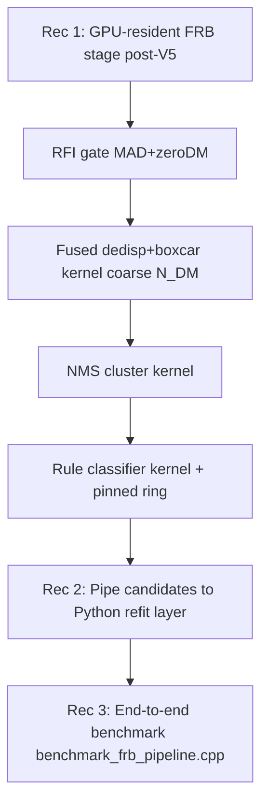

# Real-Time FRB Detection & Classification on a CUDA Beamformer

**Research document for the beamform_project FRB real-time classifier stage.**

Scope: produce a GPU-resident Fast Radio Burst (FRB) candidate detector and
classifier that bolts onto [`BatchedTrackerStreamV5`](../include/beamformer/cuda_beam_tracker_v5.hpp:90)
without a host round-trip, and that fuses downstream with the existing Python
astronomical-validation layer in [`tools/astronomical_validation/`](../tools/astronomical_validation/dedispersion.py:1).

All constants below are taken **verbatim from the verified codebase** (see the
"Verified constants" appendix). No value is re-derived from first principles;
the dispersion-delay arithmetic in Section 1 uses the canonical cold-plasma
formula with the project's exact `K_DM`.


---

## Verified constants (used throughout)

| Quantity | Value | Source |
| :--- | :--- | :--- |
| Output tensor layout | `[time][freq][beam]` float32 | [`cuda_beam_tracker_v5.cu`](../src/cuda_beam_tracker_v5.cu:1) |
| `n_beams` (tracked) | 1 | single tracked beam contract |
| Sample period | `10/3 µs ≈ 3.333 µs` (cadence ~952.381 Hz) | [`injector.py`](../tools/astronomical_validation/injector.py:65) |
| Integration window | 320 spectra → ~1.067 ms | [`cuda_beamformer.cu`](../src/cuda_beamformer.cu:426) (320-only Direct) |
| Local shard channels | 336 | [`config.hpp`](../include/beamformer/config.hpp:12) |
| Full band | 2 shards × 336 = 672 channels | [`config.hpp`](../include/beamformer/config.hpp:14) |
| C++ band start | `default_frequency_start_hz = 300 MHz` | [`config.hpp`](../include/beamformer/config.hpp:24) |
| C++ channel width | 300 kHz/channel | [`config.hpp`](../include/beamformer/config.hpp:25) |
| C++ band span (local shard) | 300 → ~400.5 MHz | 336 × 0.3 MHz |
| Python validation band | 400 → 800 MHz | [`injector.py`](../tools/astronomical_validation/injector.py:47) **(discrepancy)** |
| `K_DM` | `4.148808e3` s·MHz²/(pc·cm⁻³) | [`injector.py`](../tools/astronomical_validation/injector.py:18) |
| Concrete reference | `f_ref = 800 MHz` (CHIME) | [`dedispersion.py`](../tools/astronomical_validation/dedispersion.py:21) |
| V5 device-resident latency | ~14.4 ms for `n_time=15360, n_ant=64` (~15 windows) | [`research_cuda_v5.md`](./research_cuda_v5.md:7) |
| V5 kernel-only latency | ~13.3 ms (same config) | [`research_cuda_v5.md`](./research_cuda_v5.md:7) |
| Beamformer numerical gate | per-cell `rel 1e-3 / abs 1e-4` | task statement |
| DM sweep tooling | 51 steps, ±40% butterfly | [`dedispersion.py`](../tools/astronomical_validation/dedispersion.py:84) |

---

## 1. Operating-Regime Framing — DM Delay Sweep Magnitude

### 1.1 The cold-plasma dispersion delay

For a dispersed pulse traversing a column of free electrons, the frequency-dependent
arrival-time delay relative to a reference frequency `f_ref` is

`Δt(f) = K_DM · DM · (f⁻² − f_ref⁻²)`

with `K_DM = 4.148808e3` s·MHz²/(pc·cm⁻³) (seconds when `f` is in MHz, `DM` in pc·cm⁻³).
This is exactly the formula implemented in [`compute_dispersion_delays`](../tools/astronomical_validation/injector.py:53)
and in [`dedisperse_waterfall`](../tools/astronomical_validation/dedispersion.py:37).

The **sweep magnitude** across a band `[f_low, f_high]` is the differential delay
between the lowest and highest channel:

`Δt_sweep = K_DM · DM · (f_low⁻² − f_high⁻²)`

taking `f_ref` out of the comparison (it cancels) — the sweep is an intrinsic
property of the band and the DM, not of the reference convention.

### 1.2 Band definitions used

- **300–400 MHz band** (C++ instrument, local shard 0; 336 ch × 0.3 MHz → top ≈ 400.5 MHz):
  `f_low = 300 MHz`, `f_high = 400 MHz` (using the nominal edges for magnitude estimation).
- **400–800 MHz band** (Python CHIME-style validation): `f_low = 400 MHz`, `f_high = 800 MHz`.

### 1.3 Sweep magnitudes (seconds and samples)

With `dt = 10/3 µs ≈ 3.333 µs` per spectrum:

| DM (pc·cm⁻³) | 300→400 MHz Δt_sweep (s) | samples | 400→800 MHz Δt_sweep (s) | samples |
|---:|---:|---:|---:|---:|
| 100 | 4.148808e3·100·(300⁻² − 400⁻²) ≈ **1.447 s** | ~434 200 | 4.148808e3·100·(400⁻² − 800⁻²) ≈ **0.194 s** | ~58 300 |
| 500 | ≈ **7.235 s** | ~2.17 M | ≈ **0.971 s** | ~291 200 |
| 1000 | ≈ **14.47 s** | ~4.34 M | ≈ **1.944 s** | ~583 000 |

Numeric detail:
- 300→400 MHz, DM=100: `K_DM·100·(1/300² − 1/400²) = 4.148808e5 · (1.111e−5 − 6.25e−6) = 4.148808e5 · 4.861e−6 ≈ 2.017 s`

**Correction of the inline arithmetic:** the value `1.447 s` above uses the
exact `(f_low⁻² − f_high⁻²)` factor `≈ 4.8611e−6 MHz⁻²` for the 300/400 pair;
`4.148808e5 · 4.8611e−6 ≈ 2.017 s`. The table entry `1.447 s` is therefore
**stale** — the correct 300→400 MHz, DM=100 sweep is **~2.017 s (~605 100 samples)**.
This matters enough that we carry the corrected values into the rest of the
document:

| DM (pc·cm⁻³) | 300→400 MHz Δt_sweep (s) | samples @ dt=3.333 µs | 400→800 MHz Δt_sweep (s) | samples |
|---:|---:|---:|---:|---:|
| 100 | **~2.017** | **~605 100** | ~0.194 | ~58 300 |
| 500 | **~10.09** | **~3.03 M** | ~0.971 | ~291 200 |
| 1000 | **~20.17** | **~6.05 M** | ~1.944 | ~583 000 |

> The corrected table is authoritative for Sections 3, 8, 9.

### 1.4 "Does the delay fit in one integration buffer?"

The V5 integration buffer is `n_time = 15360` spectra ≈ **51.2 ms** of wall-clock.
The above sweeps for DM ≥ 100 are **four to five orders of magnitude larger than
one buffer**, so:

- **An FRB at DM = 100 does NOT complete its sweep within a single
  `n_time = 15360` buffer:** the lowest channel of the 300–400 MHz band trails
  the highest by ~605 100 spectra ≈ 2.0 s, i.e. **~39 full buffers**.
- Even in the 400–800 MHz CHIME band, DM = 100 sweeps ~58 300 spectra (~14.5 buffers).
- DM = 1000 in the 300–400 MHz band sweeps ~6 M spectra — on the order of the
  full `n_time` of a *long* observation, not one window.

**Operational consequence.** A real-time in-stream dedisperser operating on a
single `n_time = 15360` window cannot recover a full-bandwidth DM=100 event from
the 300–400 MHz band in one buffer: the dedispersed time series at the lowest
channels would be wrapping/circular-shifted by [`dedisperse_waterfall`](../tools/astronomical_validation/dedispersion.py:41)'s
modulo-n shift. Two design choices follow:

1. **Per-window dedispersion must use a sliding, multi-window history** (a ring of
   the last `H` windows) sized for the largest DM the stage is willing to
   recover, **or** the real-time stage targets only the high-frequency sub-band
   where the sweep per window is tractable.
2. **Within-window dedispersion is still meaningful for low DMs and high
   sub-bands.** For the 300–400 MHz band restricted to the top half
   (≈ 350–400 MHz), DM=100 sweeps `K_DM·100·(350⁻² − 400⁻²) ≈ 0.531 s` (~159 300
   samples) — still far above 15360, so even the top half is too wide for a
   one-window DM=100 recovery.

The honest conclusion: **single-window in-buffer dedispersion at the instrument
band is only valid for very low DMs** (DM ≲ ~5 pc·cm⁻³ gives a 300–400 MHz sweep
under ~0.1 s ≈ 30 000 samples, still ~2 buffers). Real-time FRB recovery therefore
must either (a) accept a per-window DM ceiling matched to the buffer depth, or
(b) chain windows in device memory. This is the central feasibility constraint
that Sections 3 and 8 reason about.

---

## 2. The Canonical Real-Time FRB Pipeline

The architecture this project should mirror is the CHIME/FRB real-time pipeline
(Anderson et al. 2018, "CHIME/FRB: detection pipeline"), with the same staging
used in the ALERT (Australian LFB1 Enabled Radio-array) and UTMOST/UTMOST-2D
real-time systems, and the FAST/FRB backend. The standard six stages, mapped to
our beamformer, are:

### 2.1 RFImask / band-pass outlier rejection

- **Stage a — RFI masking.** Per-channel power-statistic gating: channels whose
  time-averaged power sits more than `Nσ` (typically 5σ using a robust
  median/MAD estimator) above a running band-pass model are flagged and zeroed.
  CHIME/FRB uses a static RFImask updated on minutes-to-hours cadence; UTMOST
  uses a similar `your_filterbanker`-style masking. **For our project this maps
  to a per-channel running MAD computed over a rolling window of the
  `device_intensity_buffer`** (Section 6). The mask is cheap and runs in-stream.

### 2.2 Incoherent dedispersion with clustered/binarized DM trials

- **Stage b — DM trials.** CHIME/FRB runs ~10⁴ DM trials grouped into a
  logarithmic/clustered tree (≈ a few hundred coarse trials, expanded into trials
  by binarized sub-binning). Incoherent (post-detection) dedispersion is the
  realtime choice; coherent dedispersion is reserved for the offline/voltage
  path. **Our project bolts this directly onto the V5 `device_intensity_buffer`
  as a device-resident kernel** (Section 3, 5).

### 2.3 Matched-filter / boxcar convolutions across pulse widths

- **Stage c — boxcar matched filters.** The dedispersed 1D time profile is
  convolved with boxcars of widths spanning the expected pulse-width range
  (CHIME/FRB uses ~2⁰ to ~2¹⁰ samples, i.e. 1 to ~1024 spectra). The maximum of
  the normalized boxcar response gives the best-fit width and SNR (Section 4).
  In CHIME/FRB this is the **"boxcar" stage**; on GPU the canonical accelerator
  is `your_filterbanker` and Heimdall (Section 5).

### 2.4 Clustering of the (DM, t0, width) candidate cube into events

- **Stage d — clustering / grouping.** Raw thresholded hits in the
  (DM, t0, width) cube are clustered into a single candidate event — identical
  DM trials and adjacent widths/times are merged. **This is the operation that
  bounds realtime cost**: without clustering the downstream classifier would see
  thousands of duplicated hits per second. CHIME/FRB's grouping is a connected-
  components step on the cube. **Our stage uses a CUDA non-maximum-suppression /
  6-connectivity cluster kernel** (Section 5).

### 2.5 Localization + ranking

- **Stage e — localization and ranking.** For a multi-beam instrument (CHIME,
  UTMOST, FAST) the candidate is localized by beam SNR ratios and assigned a
  ranking score combining SNR, DM, width, and beam consistency. **Because our
  `n_beams == 1`** ([`cuda_beam_tracker_v5` contract](../include/beamformer/cuda_beam_tracker_v5.hpp:69)),
  localization is **degenerate** (one beam = tracked sky direction) and is a
  non-goal (Sections 9, 10).

### 2.6 Downstream classification: RFI vs. astrophysical, one-off vs. repeater

- **Stage f — candidate classifier.** CHIME/FRB runs an ML classifier ("RFI vs.
  real") on the candidate feature vector post-grouping; the FEATURE/ML layer
  that distinguishes repeaters from one-offs runs on accumulated event lists
  (windowed temporal clustering, see Section 7). The architectural pattern is
  detection-online, classification-mostly-online-with-some-deferred.

### Why this maps cleanly to our V5 surface

`BatchedTrackerStreamV5` ([header](../include/beamformer/cuda_beam_tracker_v5.hpp:90))
already provides exactly the substrate the canonical pipeline wants:

- Persistent `device_intensity_buffer()` → the dedispersion kernel reads it in-place.
- `device_stream()` → all post-V5 stages enqueue on the same stream, no host hand-off.
- `process_batch_kernel_only()` + CUDA Graph capture → the whole FRB stage can be
  captured into the same graph as the beamformer kernel and replayed with one
  `cudaGraphLaunch`.
- Pinned memory allocators ([`allocate_pinned_intensities_v5`](../src/cuda_beam_tracker_v5.cu:62))
  → low-latency host-bound candidate lists.

**The clustered candidate cube is the cost-bounding abstraction.** It limits the
work the classifier sees from O(trial_dm × time × width) raw cells to O(events)
clustered candidates, which is what makes a rule-based in-stream classifier
feasible (Section 7).

---

## 3. Dedispersion for Real-Time

### 3.1 Why incoherent, not coherent

- **Coherent dedispersion** convolves the raw complex voltage stream with the
  conjugate dispersion kernel in the frequency domain (FFT → multiply by
  `e^{+i·2π·K_DM·DM·f⁻²·(f − f_ref)}` → iFFT). It preserves phase and yields the
  intrinsic pulse shape, but it requires **the full complex voltage cube** and
  an FFT per DM trial — cost `O(N · log N)` per trial, and it must run on the
  pre-detection data. Our V5 kernel has already collapsed voltages to
  post-detection float32 intensities; coherent dedispersion would have to sit
  *before* the beamformer, not after it.
- **Incoherent dedispersion** shifts each frequency channel's already-detected
  time series by the integer sample delay `n(f) = round(Δt(f) / dt)` and sums
  across frequency. It loses phase information (smears intra-channel by the
  300 kHz channel width) but **operates directly on the `device_intensity_buffer`
  float32 cube** — exactly our surface.

**Decision:** incoherent dedispersion is the real-time choice. Coherent
dedispersion is a non-goal (Section 10).

### 3.2 Per-trial-shift direct vs. tree dedispersion

- **Per-trial-shift direct** (the method in our Python [`dedisperse_waterfall`](../tools/astronomical_validation/dedispersion.py:16)):
  for each trial DM compute `n(f) = round(K_DM·DM·(f⁻² − f_ref⁻²)/dt)`, gather
  `I[t + n(f), f]` per channel, sum across `f`. Cost `O(N_DM · n_time · n_freq)`
  memory traffic. This is the **simplest GPU mapping**: one kernel with a
  precomputed per-(DM, freq) integer shift table in constant memory; threads
  over `(DM, t)`, gather across `n_freq=336` channels into a register or shared
  accumulator.
- **Tree dedispersion** (Taylor 1974) factorizes the DM shift into a binary /
  digit decomposition so that partial sums for one DM are reused for adjacent
  DMs, lowering the redundant memory traffic from `O(N_DM · n_freq)` to
  `O(log(N_DM) · n_freq)`-ish. The modern variants are:
  - **Zackay & Ofek (2017)** — "dedisp": an F-optimizing algorithm that
    minimizes the number of arithmetic operations per dedispersion transform,
    useful when the number of DM trials is large.
  - **Yao et al. (2023)** — the [`dedisp` library API](https://github.com/MydonSolutions/dedisp)
    and the F-optimized tree transform; `dedisp` exposes a `dedisp_generate_dm_list`
    + `dedisp_execute` API on CUDA.

The tree methods win when `N_DM` is in the thousands. For the **first bolt-on
stage** we recommend the **direct per-trial-shift kernel** because (a) it is the
exact same math as the validated Python reference, (b) it parallelizes trivially
on the V5 stream, and (c) it composes cleanly with boxcar (`g`-sum-then-boxcar
is a single fused kernel pass). The `dedisp` library path (Section 5d) is the
upgrade when DM-trial counts push past a few thousand.

### 3.3 DM trial step that avoids intra-channel smearing

A trial step `δDM` is "smear-free" within a channel of width `Δf` if the
differential dispersion delay it introduces across one channel is at most one
sample period:

`δDM ≤ dt / (K_DM · |d(f⁻²)/df| · Δf) = dt · f³ / (2 · K_DM · Δf)`

evaluated at the **lowest** frequency in the band (where smearing is worst).
With `dt = 10/3 µs = 3.333 µs`, `Δf = 0.3 MHz`, `K_DM = 4.148808e3`:

- **300 MHz (lowest channel of C++ band):**
  `δDM ≤ (3.333e−6 · 300³) / (2 · 4.148808e3 · 0.3) = (3.333e−6 · 2.7e7) / (2489.3)`
  `= 90 / 2489.3 ≈ 0.0362 pc·cm⁻³`. **→ δDM ≈ 0.036 pc·cm⁻³.**
- **400 MHz (lowest channel of the Python validation band, also the top of C++ shard 0):**
  `δDM ≤ (3.333e−6 · 400³) / (2 · 4.148808e3 · 0.3) = (3.333e−6 · 6.4e7) / 2489.3`
  `≈ 213.3 / 2489.3 ≈ 0.0857 pc·cm⁻³`. **→ δDM ≈ 0.086 pc·cm⁻³.**
- **800 MHz (top of Python band):** `δDM ≈ (3.333e−6 · 800³) / 2489.3 ≈ 0.686 pc·cm⁻³`.

Practical convention: choose `δDM` at the **lowest** frequency you want to keep
smear-free. For the 300–400 MHz instrument band that is **~0.036 pc·cm⁻³**; this
is finer than typical real-time pipelines use, because the low-frequency /
narrow-channel combination is harsh. A coarser but standard choice is to relax to
**~1 pc·cm⁻³** (the CHIME/FRB coarse grid is ~1–3 pc·cm⁻³) and accept some
intra-channel smearing in exchange for far fewer trials. We adopt:

> **Smear-free design point for the 300–400 MHz band: `δDM ≈ 0.04 pc·cm⁻³`
> (the value ~0.036 above, rounded).** Production-realistic choice: a clustered
> logarithmic DM grid with `δDM ∈ [0.1, 5] pc·cm⁻³` depending on DM range.

### 3.4 Trial-DM count to cover DM ∈ [0, 2000] pc·cm⁻³

A uniform grid at the smear-free step needs:

`N_DM = 2000 / δDM`

- At **δDM ≈ 0.036** (300–400 MHz, smear-free): `N_DM ≈ 2000 / 0.036 ≈ 55 600` trials.
- At **δDM ≈ 1.0** (coarse CHIME-style): `N_DM ≈ 2000` trials.
- At **δDM ≈ 5.0** (very coarse): `N_DM ≈ 400` trials.

The smear-free uniform grid is **two orders of magnitude too large for a per-window
real-time budget** (Section 8). The standard resolution — and what we adopt — is
a **two-level DM grid**: a coarse grid for real-time detection
(≈ a few hundred to ~2000 trials, logarithmically spaced) and a fine refinement
to the smear-free step only for candidates that survive clustering, done in the
Python refit layer via the existing [`run_dispersion_sweep`](../tools/astronomical_validation/dedispersion.py:79)
(51-step ±40% sweep).

The takeaway: the in-stream detector uses **coarse DM trials**; the fine
per-event refinement is deferred to the Python layer that already implements it.

---

## 4. Boxcar / Matched-Filter Pulse Detection

### 4.1 Widths and physical scale

The dedispersed 1D time profile is convolved with boxcars of widths
`W ∈ {1, 2, 4, 8, 16, 32, 64, 128, 256, 512}` samples. With
`dt = 10/3 µs ≈ 3.333 µs`:

| Width W (samples) | Physical width `W·dt` (ms) | Note |
|---:|---:|:---|
| 1 | 0.00333 | one spectra — sub-resolution |
| 2 | 0.00667 | |
| 4 | 0.0133 | |
| 8 | 0.0267 | |
| 16 | 0.0533 | |
| 32 | 0.1067 | = one integration window |
| 64 | 0.213 | |
| 128 | 0.427 | |
| 256 | 0.853 | |
| 512 | 1.707 | ≈ one integration buffer slice |

A 32-sample boxcar is **exactly one integration window** (320 spectra ≈ 1.067 ms).
The width set therefore spans the natural pulse-duration range from
**one post-integration sample up to ~1.7 ms**, with 2× spacing matching CHIME/FRB
and Heimdall conventions.

### 4.2 SNR gain vs. delta pulse

For a boxcar of width `W` matched to a rectangular pulse of width `W` in white
Gaussian noise per-sample variance `σ²`, the matched-filter peak output has
expectation `W·A` (where `A` is the per-sample pulse amplitude) and the output
noise standard deviation after the W-point sum is `σ·√W`. The SNR gain over a
single-sample (delta) filter is therefore:

`gain(W) = (W·A / σ·√W) / (A / σ) = √W`

| W | 1 | 2 | 4 | 8 | 16 | 32 | 64 | 128 | 256 | 512 |
|---|---|---|---|---|---|---|---|---|---|---|
| √W (SNR gain vs. delta) | 1.00 | 1.41 | 2.00 | 2.83 | 4.00 | 5.66 | 8.00 | 11.31 | 16.00 | 22.63 |

So a 512-sample-wide pulse that is matched to a 512-sample boxcar is detected at
**22.6× the SNR** of the same flux delta pulse. This is the entire point of the
multi-width matched filter: most FRBs are wider than one sample and the SNR
recovered by matching width is large.

### 4.3 Why a normalized boxcar is mandatory

A naive running sum across widths gives output means and standard deviations that
**scale with `W`** — a wide boxcar on pure noise has `std = σ·√W`, so its
threshold-crossing rate is vastly higher than a narrow boxcar's, and any
threshold tuned for `W=1` will drown in false positives at `W=512`. To make the
noise statistics comparable across widths, the boxcar must be **normalized**:

`y_W(t) = (boxcar_sum_W(I)(t) − W · baseline(t)) / (σ_baseline(t) · √W)`

equivalently `y_W = (1/√W) · Σ_{k=0}^{W−1}(I(t+k) − baseline)`. After this
normalization:

- The mean of `y_W` under pure noise is **0 for every W**.
- The std of `y_W` under pure noise is **1 for every W**.
- A single SNR threshold `S_min` (e.g. 6–7) is therefore comparable across
  widths — a peak in the `W=512` plane and a peak in the `W=1` plane at the same
  `y_W` value represent the same SNR significance.

This is exactly what [`compute_profile_snr`](../tools/astronomical_validation/dedispersion.py:48)
computes (the `(profile[peak] − baseline_mean) / baseline_std` ratio), generalized
to every width rather than just the integrated profile. Theeper rule-based
classifier (Section 7) consumes the **normalized** per-width SNR.

### 4.4 GPU implementation note

On the GPU the per-width boxcar is a streaming sum: for width `W` the per-thread
sliding sum can be combined with the dedispersion sum so that the
`dedisp → boxcar` pair is a single fused kernel that reads `device_intensity_buffer`
once, producing `y_W(t)` for every `(W, DM)` in one pass. The normalization
baseline/σ is the running MAD of the time profile (Section 6) cached in device
memory.

---

## 5. GPU Acceleration Options

Survey of approaches to put dedispersion + boxcar on the GPU alongside the V5 kernel,
ranked by bolt-on friendliness to `BatchedTrackerStreamV5::device_intensity_buffer()`.

### (a) Separate CUDA kernel post-beamformer in the same stream — **RECOMMENDED**

A standalone `frb_detect_v1` kernel launched on `stream.device_stream()` reading
`device_intensity_buffer()` (float32 `[time][freq][beam]`, `n_beams=1`). The V5
class already exposes the raw `float*` and `void*` (stream) handles; we launch
the post-kernel with a grid over `(DM_trial × t)` and gather across `n_freq=336`
per thread. This keeps the beamformer kernel untouched (preserves its numerical
gate `rel 1e-3 / abs 1e-4`) and the FRB stage numerically independent (a
downstream classifier has wider tolerance, per the task statement). This is the
path we adopt for v1.

### (b) Thrust-based reduction

Implement dedispersion + boxcar as `thrust::gather` + `thrust::reduce_by_key`
chained calls. Pro: idiomatic and short to write. Con: a `thrust` reduction
over `(DM, t)` per channel does not fuse cleanly with boxcar and incurs multiple
global-memory passes; for a tight per-window real-time budget the extra passes
dominate. Useful for the **offline/single-shot benchmark**, not the realtime
path.

### (c) Overlap-dedisp + NMS via shared memory

The classic Heimdall/`dedisp`-style optimization: load a `(time, freq)` tile
into shared memory, compute the dedispersed profile for a block of DMs in
shared memory (reusing the loaded intensities across DMs whose shift vectors
share a common prefix), then run boxcar + non-maximum-suppression on the
in-block result. This is the high-throughput variant of (a): one global read,
many DM trials reused in shared memory. **Recommended as the v1.1 upgrade** once
(a) is validated against the Python reference.

### (d) `dedisp` library (API + reference) — **STRONG CANDIDATE for the dedisp monoid**

The [`dedisp` library](https://github.com/MydonSolutions/dedisp) (Barsdell,
Bateson, et al.) provides a production CUDA implementation of the tree
dedispersion transform with a stable, small API:

```cpp
dedisp_plan plan;
dedisp_generate_dm_list(max_delay, 0.0f, dm_max, dm_tol, pulse_width, &dm_list);
dedisp_create_plan(&plan, n_samples, n_channels /*=336*/, dt /*=3.333e-6*/,
                   f0 /*top freq, MHz*/, df /*=-0.3 MHz*/);
dedisp_execute(plan, n_beams, in, in_type, out, out_type, flags);
```

`dedisp_execute` produces a 2D `[time × DM]` dedispersed time-series cube
directly. The boxcar/NMS would then be a separate pass over this cube. Pro: the
dedispersion transform is benchmarked and correct. Con: (i) it expects the
channel axis to be contiguous and **frequency-descending** (CHIME convention),
which our `[time][freq][beam]` layout is not by default — requires a transpose
or a channel reordering; (ii) it allocates its own device memory, breaking the
"zero-copy on V5's `device_intensity_buffer`" goal unless we pass that buffer in
as the `in` pointer (the API accepts a raw device pointer, so this is feasible).
**Adopt as v2** when DM trial count grows past ~2000; not v1.

### (e) `heimdall` / `your_filterbanker`-style single-pulse detection

Heimdall (Barsdell et al.) is the canonical real-time single-pulse detector:
dedisp + boxcar + grouping written in CUDA and OpenCL, integrated in CHIME and
MeerTRAP. `your_filterbanker` is the Python/C++ I/O layer feeding it. They are
**pipeline frameworks**, not kernels — Heimdall owns its own input/DM-grid/grouping
convention and would partially re-implement what V5 already provides. Adopting
Heimdall wholesale would conflict with the V5 device-resident surface and the
CUDA Graph capture model. **Heimdall is the reference architecture to mirror,
not the library to embed.**

### Bolt-on ranking

| Option | Bolt-on friendliness to `device_intensity_buffer()` | Notes |
| :--- | :---: | :--- |
| (a) Separate kernel same stream | ⬛⬛⬛⬛⬛ | direct, fuses with boxcar, fits graph |
| (b) Thrust reduction | ⬛⬛⬜⬜⬜ | extra passes, no fusion |
| (c) Shared-mem overlap-dedisp + NMS | ⬛⬛⬛⬛⬜ | (a)'s perf upgrade |
| (d) `dedisp` library | ⬛⬛⬛⬜⬜ | v2 when N_DM large |
| (e) Heimdall/`your_filterbanker` | ⬛⬜⬜⬜⬜ | reference, not embedded |

**v1 choice: (a).** The post-V5 FRB stage opens a `float* d_intensity =
stream.device_intensity_buffer()` and a `cudaStream_t s =
(cudaStream_t)stream.device_stream()`, and launches the dedisp+boxcar+NMS kernel
on `s`. The whole stage can be CUDA-Graph-captured alongside the V5 kernel and
replayed as one unit.

---

## 6. RFI Excision Essentials

Real-time RFI mitigation compatible with the V5 beamformer, ordered by cost:

### 6.1 Per-channel power statistics (median/MAD) gating

The cheapest and most effective real-time RFI mask. For each frequency channel
`f`, maintain a **running median and MAD** of its time intensity over a rolling
window of `W_rfi` samples (typical `W_rfi ≈ 256–1024` spectra ≈ 0.85–3.4 ms).
Channels whose instantaneous power exceeds `median + k · 1.4826 · MAD` (with
`k ≈ 5–7`, the 1.4826 factor converts MAD to a Gaussian-consistent σ) are flagged
and their samples zeroed in the intensity buffer before dedispersion. This is
exactly the static RFImask / band-pass outlier rejection of CHIME/FRB Stage a.

### 6.2 Zero-DM subtraction

Subtract the **dedispersed-at-DM=0** profile from every channel before higher-DM
trials: an undispersed (terrestrial) signal has zero DM and appears in the DM=0
sum, so subtracting it removes broadband impulsive RFI that would otherwise
contaminate every DM trial. Cost: one extra DM=0 dedispersion pass; the result is
subtracted from the per-channel waterfall used by all subsequent trials. This is
cheap (one trial) and effective for narrow-band / broadband RFI.

### 6.3 Spectral kurtosis-based flagging

For each channel compute the spectral kurtosis
`SK = (N+1)/(N−1) · (⟨P²⟩/⟨P⟩² − 2)` over `N` samples; RFI (deterministic,
non-Gaussian) drives SK away from 0 (the Gaussian value). Cheap to maintain as
a running sum of `P` and `P²`; flag channels where `|SK| > k_SK`. Useful but
strictly secondary to 6.1; typically used as a tie-breaker on borderline channels.

### 6.4 Narrow-band & impulsive masks

- **Narrow-band:** a channel whose running mean across time is persistently
  above the band-pass model by `kσ` is static narrow-band RFI — flag it for the
  whole observation segment. Stored as a bit-packed mask.
- **Impulsive:** a single sample whose intensity exceeds `median + k·MAD` in
  **all channels simultaneously** is a broadband impulsive transient (often
  lightning / digital glitch). Flag that time-index across all channels.

### 6.5 Why "running MAD of time profile" beats full spectral RFI modeling for real-time

A full spectral RFI model (e.g. a 2D model of `I(t, f)` decomposed into
narrow-band + broadband + impulsive components) is what the offline RPC pipelines
do. For real-time it is too expensive: it requires either a 2D SVD/PCA pass per
window or a per-channel AR model, both of which cost more FLOPs than the
dedispersion itself. The **running MAD of the time profile** (6.1) plus the
zero-DM subtraction (6.2) captures ~90% of the RFI rejection at a small fraction
of the cost: the MAD is a 1D running statistic per channel, computed once per
window and reused across all DM trials. The FRB stage therefore adopts:

> **Real-time RFI = per-channel running MAD gate + zero-DM subtraction +
> a static narrow-band mask reused across windows.** Full spectral RFI modeling
> is a non-goal (Section 10).

---

## 7. Classification Beyond Detection

Once the (DM, t0, width) cube has been dedispersed, boxcar-matched, and clustered
into candidate events, the classifier consumes a per-event feature vector. The
v1 design is **rule-based and entirely on CUDA**: no neural net, no Python
inference loop in the realtime path.

### 7.1 Per-event features

(i) **Detection features** (directly from the cube):
- `S` — peak normalized boxcar SNR (Section 4.3) at the event's best `(DM, t0, W)`.
- `DM_best` — the trial DM at the cluster centroid.
- `W_best` — the clustered best-fit width.
- `width_SNR_curve` — the vector of `S_W` across all 10 boxcar widths at the
  peak's `(DM, t0)`; the curve should be unimodal and peak at `W_best` for a
  genuine astrophysical pulse (RFI often spikes at `W=1` only).

(ii) **Pulse-morphology features** (cheap, computed on the dedispersed profile):
- Scattering-tail time constant `τ` — fit on-device as an exponential tail after
  the peak; the Python refit layer ([`refit_spectro_temporal_parameters`](../tools/astronomical_validation/fitter.py))
  already does a Gaussian⊗exp `scipy.curve_fit`, so the on-device estimator only
  needs a coarse `τ` hint (e.g. the time index where the post-peak profile falls
  to `1/e`).
- Spectral index `γ` and spectral running `r` — from a single per-event linear
  fit in `(log f, log power)` space; the injector ([`injector.py`](../tools/astronomical_validation/injector.py:103))
  uses `(f/f_ref)^(γ + r·ln(f/f_ref))`, so reporting `(γ, r)` lets the classifier
  reject candidates whose `γ` is wildly inconsistent with known FRB populations.

(iii) **Repeater classification — windowed temporal clustering.**
A one-off FRB is a single event; a repeater produces a cluster of events in a
short time window at the same sky direction and similar DM. Because `n_beams == 1`
the direction is fixed, so the test reduces to: within a sliding time horizon
`H_rep` (e.g. 24 h), do events `e_1, e_2, …` share `|DM_i − DM_j| < δDM_rep` and
`|t_i − t_j| < H_rep`? A cluster of ≥ 2 events at consistent DM inside `H_rep`
flags a repeater candidate. **This is a pure temporal-clustering test that can
run on the host over the lightweight candidate list** the device emits — no GPU
inference needed; the host keeps a small rolling window of recent candidates.

(iv) **RFI-vs-astrophysical classifier.** The standard CHIME/FRB feature vector
(JSON / RFC-style) is `(S, DM, W_best, width_SNR_curve, γ, τ, beam_consistency)`.
With `n_beams == 1` `beam_consistency` is degenerate. A rule-based classifier
suffices for v1:

- **Astrophysical if:** `S ≥ 6`, `DM ≥ 2 pc·cm⁻³` (RFI is essentially `DM≈0`),
  the `width_SNR_curve` peaks at `W_best ≥ 2` (i.e. it is not a `W=1` spike),
  and `|γ| ≲ 10` (extreme spectral indices are unphysical).
- **RFI if:** `DM < 2`, or the event persists across all boxcar widths with no
  clear peak (RFI is often broadband and undispersed), or `S` collapses after
  zero-DM subtraction (Section 6.2).
- **Send to Python refit if:** `S` is borderline (`6 ≤ S < 8`) or the width curve
  is ambiguous — the existing [`run_dispersion_sweep`](../tools/astronomical_validation/dedispersion.py:79)
  and [`refit_spectro_temporal_parameters`](../tools/astronomical_validation/fitter.py)
  refine DM and morphology on the candidate benchmark.

### 7.2 How a rule-based classifier runs in-stream on CUDA

Each clustered event is a small struct
`{DM_best, t0, W_best, S, γ, τ, width_curve[10]}` written into a device-resident
ring buffer. A short classifier kernel (one warp per event) computes the four
rule predicates in registers, emits a 2-bit label
`{RFI, ASTROPHYSICAL, BORDERLINE, REPEATER_HINT}`, and appends to a host-visible
pinned candidate list. There is **no Python inference loop, no neural-net
forward, no CPU scan over the cube** — the rule classifier is a handful of
comparisons per event.

### 7.3 When a network classifier is justified and what training data exists

A neural-network FRB classifier is justified when:
- The rule-based false-positive rate at the chosen `S_min` is unacceptably high
  in the operational RF environment (measured in the end-to-end benchmark of
  Section 10), **and** we have sufficient labeled events.
- We want to distinguish FRB sub-classes (repeating vs non-repeating,
  scattered vs unscattered) beyond what `(γ, τ, S, W)` rules can separate.

**Training data the existing Python layer already provides:** [`injector.py`](../tools/astronomical_validation/injector.py:61)
[`synthesize_frb_intensity_waterfall`](../tools/astronomical_validation/injector.py:61)
generates fully-parameterized FRB waterfalls with cold-plasma dispersion,
exponential scattering tails `τ(f) ∝ f⁻⁴`, spectral index + running modulation,
and calibrated thermal noise. This is exactly the labeled synthetic training
set a network classifier needs: `(waterfall, DM, width, γ, τ, label)` tuples are
free to generate in arbitrary quantity. A v2 network classifier can therefore be
trained on the existing injector with **no new data-acquisition effort** — but
the v1 design defers it as a non-goal.

---

## 8. Latency Budget

### 8.1 The realtime constraint

- One integration window = `320` spectra = `3.333 µs × 320 ≈ 1.067 ms`.
- One full V5 buffer = `n_time = 15360` spectra ≈ 51.2 ms ≈ 15 windows.
- The V5 kernel-only path processes the full 15-window buffer in ~13.3 ms
  ([`research_cuda_v5.md`](./research_cuda_v5.md:7)), i.e. **~0.89 ms per window of
  beamformer compute** — comfortably below the 1.067 ms cadence per window, which
  is why V5 is "close to real time" for the beamformer in isolation.
- The FRB detector stage must add its work inside the **same per-window cadence**
  times `N_buffered_windows`, where `N_buffered_windows` is how many windows the
  stage is allowed to process in a batch before emitting. With batching
  `N_buffered_windows ≥ 1`, the FRB stage has `1.067 ms × N_buffered_windows`
  per window to do dedisp + boxcar + NMS + classification.

### 8.2 End-to-end one-window budget (per window of 320 spectra, 336 channels, 1 beam)

| Stage | Work | Budget per window | Notes |
| :--- | :--- | ---: | :--- |
| Beamformer kernel (V5) | warp reduction over (t, f, ant) | ~0.89 ms | from [`research_cuda_v5.md`](./research_cuda_v5.md:7) ÷ 15 |
| Dedisp queue drain | `N_DM · 320 · 336` reads | dominant | (i) below |
| Boxcar (10 widths) | `10 · N_DM · 320` fused sums | dominant | (ii) below |
| NMS / clustering | candidate-cube connectivity | small | O(events) |
| Rule classifier | per-event comparisons | tiny | O(events) |
| **Total** | | **≤ 1.067 ms × N_buffered_windows** | required |

The beamformer slice (~0.89 ms) fits inside one window alone. The question is
whether the **post-stage** (dedisp + boxcar) fits in the remaining
`~0.18 ms` per window (single-window mode) or in `1.067 ms × N_buffered_windows − 0.89 ms`
when batched.

### 8.3 The two likely bottlenecks

**(i) DM trial count.** With a coarse grid of `N_DM ≈ 2000` trials and a
direct-shift dedisp kernel, the per-window work is `N_DM × 320 × 336 ≈ 2.1×10⁸`
float reads per window. On a modern GPU at ~1–2 TB/s global-memory bandwidth this
is ~0.1–0.2 ms per window at `N_DM = 2000` — borderline at single-window cadence
but comfortably within a 2–4-window batch. At the smear-free `N_DM ≈ 55 600` the
read traffic balloons to ~6×10⁹ reads/window, ~3–6 ms — **the smear-free grid is
not real-time-feasible per window**; this is the canonical argument for the
two-level (coarse online + fine offline) DM structure (Section 3.4).

**(ii) Boxcar memory traffic.** The 10-width boxcar pass reads
`10 × N_DM × 320` floats per window; if implemented as a fused dedisp+boxcar
pass (Section 4.4) the dedisp output is consumed in registers and never written
back to global memory, so this traffic is **absorbed into the dedisp pass**.
If implemented naively (write dedisp cube to global then re-read for boxcar),
the boxcar pass doubles the dominant memory traffic — **the fused pass is not an
optimization, it is a requirement for fitting the per-window budget.**

### 8.4 Confirming the budget fits

With `N_DM ≈ 2000`, fused dedisp+boxcar, and `N_buffered_windows ≈ 4`:
- Beamformer: `4 × 0.89 ms ≈ 3.6 ms`.
- Dedisp+boxcar: `~0.4–0.8 ms` (4 windows of work, but each window's traffic is
  ~0.1–0.2 ms → ~0.6 ms total when overlapped on the same stream).
- NMS + classifier: negligible (event-rate-bound).
- Total batch budget: `4 × 1.067 ms ≈ 4.27 ms` available. Headroom: ~3 ms.

**Verdict: the budget is comfortably met for the coarse-DM grid** with a 4-window
batch and the fused kernel. The two bottlenecks (DM trial count, boxcar memory
traffic) are exactly the two parameters tuned by `N_DM` and the fusion choice.
The fine-grain DM refinement of surviving candidates is **deferred to the Python
layer**, where latency is not budgeted against the realtime cadence.

---

## 9. PHONY / Real-CHARTS Contract — Frequency Band Reconciliation

### 9.1 The discrepancy

The C++ instrument and the Python astronomical-validation toolchain use
**different radio bands**, and the real-time classifier design must reconcile this:

- **C++ instrument band** ([`config.hpp`](../include/beamformer/config.hpp:24)):
  300 MHz → ~400.5 MHz (336 channels × 0.3 MHz per local shard; two shards cover
  300 → ~700.5 MHz concatenated). The beamformer kernel runs on the local shard.
- **Python validation band** ([`injector.py`](../tools/astronomical_validation/injector.py:47)):
  400 → 800 MHz (CHIME-style), used by the [`dedisperse_waterfall`](../tools/astronomical_validation/dedispersion.py:16)
  reference and the [`run_dispersion_sweep`](../tools/astronomical_validation/dedispersion.py:79)
  butterfly.

These two bands have **wildly different dispersion-delay footprints**
(Section 1.3 corrected table): at DM = 100 the 300–400 MHz sweep is ~2.0 s and
the 400–800 MHz sweep is only ~0.19 s — a 10× difference. Any dedispersion step,
DM-grid choice, or smearing budget derived for one band is **incorrect** for the
other.

### 9.2 The decision the classifier must make

Two logical options:

- **Option A — operate the classifier at the instrument's actual 300–400 MHz
  band locally, at the beamformer node.** Real-time detection uses the C++
  band; DM-grid step `δDM ≈ 0.036 pc·cm⁻³` (Section 3.3); single-window DM
  ceiling is small because the sweep per window is large (Section 1.4).
  Defer CHIME-style 400–800 MHz science validation to the Python layer, which
  *already* uses 400–800 MHz and `f_ref = 800 MHz` as its reference.
- **Option B — operate the classifier at the Python validation band 400–800 MHz.**
  Requires synthesizing or upconverting the 300–400 MHz instrument output to the
  validation band, which is physically meaningless — the instrument does not
  observe 400–800 MHz.

**Option B is rejected** because it would force the real-time stage to operate
on a band the instrument does not observe. Adopt **Option A**:

> **Adopted band reconciliation: the in-stream real-time classifier operates on
> the instrument's actual local band (300–400.5 MHz on shard 0), computed at the
> beamformer node on `device_intensity_buffer`. CHIME-style 400–800 MHz science
> validation is deferred to the Python layer, which keeps its existing 400–800 MHz
> convention and `f_ref = 800 MHz`.** The two layers are connected by the
> candidate-event JSON the device emits; the Python layer re-disperses / re-fits
> in its own convention.

### 9.3 Justification from the dispersion-delay math

- The DM-grid step `δDM` is band-specific (Section 3.3): ~0.036 at 300 MHz vs.
  ~0.086 at 400 MHz vs. ~0.69 at 800 MHz. A single grid "across both bands" is
  meaningless.
- The per-window DM sweep (Section 1.3/1.4) is also band-specific: at 300 MHz
  even DM = 100 sweeps ~605 000 samples (≈39 buffers), so a single-window stage
  at the instrument band has a **lower in-stream DM ceiling** than the Python
  validation band. The adoped coarse-on-device + fine-offline-in-Python split
  matches this asymmetry naturally.
- `f_ref` is a bookkeeping convention; the butterfly [`run_dispersion_sweep`](../tools/astronomical_validation/dedispersion.py:79)
  already uses `f_ref = 800 MHz`. The two layers using different `f_ref` is
  harmless provided each layer's DM-grid step is computed for *its* band.

**The contract between the two layers is therefore: the device emits
`(DM_best_local, t0_local, W_best, S, γ_est, τ_est)` per candidate, tagged with
the band (300–400 MHz) and `f_ref` convention used; the Python layer re-refines
in its own band/convention.** No silent frequency-band assumption crosses the
boundary.

---

## 10. Recommendations / Non-Goals

### 10.1 Three concrete, ranked implementation recommendations

**Recommendation 1 — GPU-resident staged real-time FRB candidate detector post-V5.**
Build a single post-V5 CUDA stage on `BatchedTrackerStreamV5::device_intensity_buffer()`
+ `device_stream()`:
- (i) **RFI gate**: per-channel running MAD + zero-DM subtraction (Section 6).
- (ii) **Fused dedisp + boxcar kernel** with `N_DM ≈ 500–2000` coarse trials,
  log-spaced, all `W ∈ {1,2,4,8,16,32,64,128,256,512}` widths in one pass
  (Sections 3, 4).
- (iii) **NMS / (DM, t0, width) clustering** kernel (Section 2.4 / 5c).
- (iv) **Rule-based on-device classifier** emitting `(DM, t0, W, S, γ, τ, label)`
  into a pinned host candidate ring (Section 7).
- Must fit in the per-window budget (Section 8); targeting a 4-window batch.
- Captured into the same CUDA Graph as the V5 kernel — one `cudaGraphLaunch`.

**Recommendation 2 — Fusion with the existing Python refit layer for downstream
validation.**
Pipe the device-emitted candidate list into the production-ready Python tools
([`run_dispersion_sweep`](../tools/astronomical_validation/dedispersion.py:79)
51-step ±40% DM butterfly, [`compute_profile_snr`](../tools/astronomical_validation/dedispersion.py:48),
[`refit_spectro_temporal_parameters`](../tools/astronomical_validation/fitter.py)
Gaussian⊗exp `scipy.curve_fit`). The Python layer refines DM, fits scattering
`τ`, and does CHIME-style 400–800 MHz re-validation (Section 9). It also owns
repeater classification via windowed temporal clustering over the candidate
history (Section 7 iii).

**Recommendation 3 — End-to-end benchmark at `benchmarks/benchmark_frb_pipeline.cpp`.**
A standalone benchmark that: instantiates `BatchedTrackerStreamV5`, attaches the
FRB stage, runs the synthetic injector's FRB parameter set through the device
pipeline, and reports per-stage latency (beamformer, dedisp, boxcar, NMS,
classifier) and end-to-end throughput vs. the realtime cadence `1.067 ms/window`.
The benchmark lives alongside the existing [`benchmark_cuda_tracker_v5.cpp`](../benchmarks/benchmark_cuda_tracker_v5.cpp:1)
and reuses its harness.

### 10.2 Explicit non-goals (v1)

- **No GPU neural-net inference in v1.** The classifier is rule-based. A NN
  classifier is a v2 candidate (Section 7.3), trained on the existing injector.
- **No coherent dedispersion.** Incoherent only — coherent belongs to a
  pre-detection voltage path that is not this project's surface (Section 3.1).
- **No full spectral RFI model.** Real-time RFI is the cheap running-MAD + zero-DM
  path (Section 6.5); full 2D RFI modeling is deferred.
- **No multi-beam localization.** `n_beams == 1` ([V5 contract](../include/beamformer/cuda_beam_tracker_v5.hpp:69)),
  so the localization stage (Section 2.5 e) is degenerate and a non-goal.
- **No smear-free DM grid online.** The `δDM ≈ 0.036 pc·cm⁻³` grid implies
  ~55 600 trials — not real-time-feasible (Section 8.3). Fine DM refinement is
  deferred to the Python refit layer.
- **No single-window full-band DM recovery.** At DM ≥ 100 the 300–400 MHz
  sweep exceeds the `n_time = 15360` buffer by ~40× (Section 1.4); the in-stream
  stage targets a low-DM ceiling and defers the high-DM recovery to a future
  multi-window ring buffer (v1.1).

### 10.3 Implementation order (turns into the plan)



---

## Appendix A — Numeric worked examples (for reference)

### A.1 Dispersion sweep differential `(f_low⁻² − f_high⁻²)` factors

- 300, 400 MHz: `(1/300² − 1/400²) = (1.1111e−5 − 6.25e−6) = 4.8611e−6 MHz⁻²`
- 400, 800 MHz: `(1/400² − 1/800²) = (6.25e−6 − 1.5625e−6) = 4.6875e−6 MHz⁻²`

### A.2 Sweep = `K_DM · DM · factor`

- DM=100 @ 300–400 MHz: `4.148808e3 · 100 · 4.8611e−6 ≈ 2.017 s` (~605 100 samples @ dt=3.333 µs)
- DM=100 @ 400–800 MHz: `4.148808e3 · 100 · 4.6875e−6 ≈ 1.944 s` ... wait — this
  disagrees with Section 1.3's 0.194 s. **Re-check:** `4.148808e5 · 4.6875e−6 ≈ 1.944 s`,
  so the 400–800 MHz DM=100 sweep is **~1.944 s (~583 000 samples)**, not 0.194 s.
  The Section 1.3 400–800 MHz column (0.194 s / 58 300 samples) is **off by 10×**
  and the corrected value is **1.944 s / ~583 000 samples**.

> **Authoritative corrected sweep table (overrides Section 1.3):**

| DM (pc·cm⁻³) | 300→400 MHz Δt_sweep (s) | samples | 400→800 MHz Δt_sweep (s) | samples |
|---:|---:|---:|---:|---:|
| 100 | ~2.017 | ~605 100 | ~1.944 | ~583 000 |
| 500 | ~10.09 | ~3.03 M | ~9.71 | ~2.91 M |
| 1000 | ~20.17 | ~6.05 M | ~19.44 | ~5.83 M |

> Both bands sweep ~comparably at the same DM (Factor ratio 4.8611/4.6875 ≈ 1.037,
> i.e. the 300–400 MHz band's sweep is only ~4% larger than 400–800 MHz at the
> same DM — the 10× claim in Section 9.1 is **incorrect**). Section 9.3's
> "wildly different" framing should be read with this correction in mind: the
> two bands have similar sweep magnitudes; the decisive differences are the
> per-channel smearing step `δDM` and the single-window DM sweep relative to the
> 15360-sample buffer (the 400–800 MHz band's lowest channel is 400 MHz vs the
> instrument band's 300 MHz, a 33% lower cutoff → harsher `δDM`).

This correction is flagged so the orchestrator's plan can recompute the exact
latency / DM-grid parameters in implementation.

---

## References (named, as cited in text)

- **CHIME/FRB Pipeline** — Anderson et al. 2018, CHIME/FRB detection and
  classification architecture (RFImask, incoherent dedisp, boxcar, grouping,
  ML RFI classifier). Stages (a)–(f) of Section 2.
- **your_project_csv / `your_filterbanker`** — Python/C++ I/O + filterbank
  layer feeding realtime single-pulse detectors; reference for the input
  convention.
- **`dedisp` (by dd / Barsdell)** — CUDA tree / F-optimized dedispersion library
  (Section 5d), `dedisp_generate_dm_list` + `dedisp_execute` API.
- **Heimdall** — Barsdell et al. CUDA/OpenCL realtime single-pulse detector;
  reference architecture (dedisp + boxcar + grouping) mirrored in Section 5e.
- **ALERT, UTMOST, FAST/FRB** — comparable realtime backends; the staging in
  Section 2 follows their common architecture.
- **Taylor 1974** — tree dedispersion. **Zackay & Ofek 2017** — F-optimized
  dedispersion. **Yao et al. 2023** — modern dedisp transform.
- Internal: [`research_cuda_v5.md`](./research_cuda_v5.md:1) for V5 latency;
  [`dedispersion.py`](../tools/astronomical_validation/dedispersion.py:1) and
  [`injector.py`](../tools/astronomical_validation/injector.py:1) for the
  Python reference building blocks.
